## Goals today

0. Unit information


[]{.space-out}

:::: columns
::: {.column width="50%" .fragment}
1. Introduction to Supply Chain
  - What is Supply Chain?
  - Supply Chain Network Flows
  - Roles of Logistics in Supply Chain
  - Supply Chain Management (SCM)
  - Push-Pull Strategies in SCM
  - Case Studies
  - Supply Chain Network Design
:::

::: {.column width="50%" .fragment}
2. Review of Optimisation Problems
  - Unconstrained Optimisation
  - Constrained Optimisation
  - Mixed Constrained Optimisation
:::

::::

---

### Materials

::: {.nonincremental}
- Unit Page: [zamnolence.github.io/scmo_book](https://zamnolence.github.io/scmo_book)
:::

### Assessments

::: {.nonincremental}
1. **20% Assignment**
  - **Available:** 6 June (5 PM), **Due:** 13 June (5:10 PM)
  - Submit a **hard copy in class** or submit it **digitally via WeChat** (ID: **cubdwi**)
  - If submit via WeChat, please tell me your name (in English) and student ID, and wait for confirmation.

  
2. **80% Final Exam** (**Duration:** 2 hours)
  - Formulas are given
:::

### Core Readings

::: {.nonincremental}
- [Ghiani, Gianpaolo, Gilbert Laporte, and Roberto Musmanno, 2003. "Introduction to logistics systems planning and control". https://doi.org/10.1002/0470014040.
](https://doi.org/10.1002/0470014040)
:::


---

## Unit Contents

### I. Logistics Network Design  
  - Single-Echelon Single-Commodity (SESC) Location Models; 
  - Two-Echelon Multi-Commodity (TEMC) Location Models;
  - Network Design under Uncertainty

### II. Demand Forecasting 
  - Time Series Regression Models;
  - Time Series Decomposition

### III. Inventory Models
  - Deterministic: Single Commodity, Discount & Multicommodity;
  - Stochastic: Single-Period & Multi-Period Models


::: notes

- Now let’s take a closer look at the core content of this unit.

- The unit is organised into three major themes:
Logistics Network Design, Demand Forecasting, and Inventory Models.

_ Begin with Logistics Network Design, which focuses on how supply chain networks are structured and optimised.

- First, we’ll study Single-Echelon, Single-Commodity Location Models.

  - These models help us determine the optimal location of facilities—such as warehouses or distribution centres—when dealing with one product and one level of distribution. 

  - Next, we move to Two-Echelon, Multicommodity Location Models.

  - Here, the system becomes more realistic and complex. We consider multiple layers in the supply chain — for example, factories and warehouses — and multiple products flowing through the network.

  - Finally, we’ll examine Network Design under Uncertainty. In reality, demand, costs, and supply conditions are rarely certain. We will learn how to incorporate uncertainty into our models to make more robust strategic decisions.

- The second theme is Demand Forecasting.

  - Accurate forecasts are critical because SC decisions rely heavily on future demand estimates.

  - We’ll cover Time Series Regression Models, which use historical data to identify trends and relationships.

  - We’ll also study Time Series Decomposition, where we break demand data into components such as trend, seasonality, and random variation. This helps us better understand patterns and improve forecast accuracy.

- The third major component is Inventory Models.

  - We begin with Deterministic Inventory Models, where demand is assumed to be known and constant. 

  - Then we move to Stochastic Inventory Models, where demand is uncertain.
:::

---

## 1. Introduction to Supply Chain

### 1.1 What is Supply Chain (SC)?
A SC is a network of individuals and companies involved in the production & distribution of goods or services, from raw material suppliers to manufacturers, ..., to the end customers.

:::{.fragment}
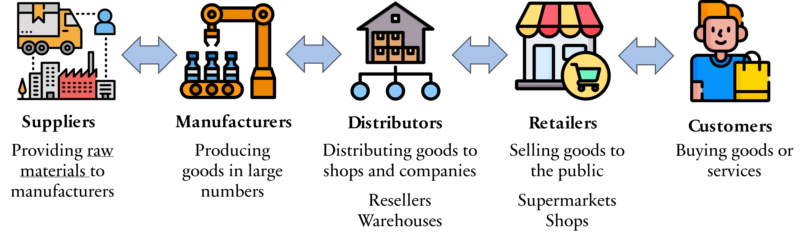{width=100% fig-align="center"}
:::

::: notes

- Now let’s begin with the fundamental question:  What is a SC?

- A SC is a network of individuals and organisations involved in producing and delivering goods or services — starting from raw material suppliers and ending with the final customer.

- It is important to emphasise the word network. A supply chain is not just one company. It includes multiple interconnected entities working together to create value.

- Let’s walk through the typical stages shown in this diagram.

- At the beginning of the supply chain, we have suppliers providing raw materials or basic components to manufacturers.
For example, steel suppliers provide materials to car manufacturers, or farmers supply ingredients to food producers.
Without suppliers, production cannot begin.

- Next are the manufacturers transforming raw materials into finished or semi-finished goods. They usually produce goods in large quantities using machinery, labour, and technology. This is where value is significantly added to the product.

- After production, goods move to distributors. Distributors are responsible for storing and transporting products to retailers or other businesses. This often involves warehouses, logistics centres, and transportation systems. Their role is to ensure products are available where and when they are needed.

- Next, we have retailers. Retailers sell goods directly to consumers. Examples include supermarkets, shops, and online stores. They are the link between businesses and final customers.

- Finally, at the end of the supply chain, we have the customers. Customers purchase and use the products.
Ultimately, the entire supply chain exists to satisfy customer demand.

- 
:::

---

### 1.2 Supply Chain Network Flows


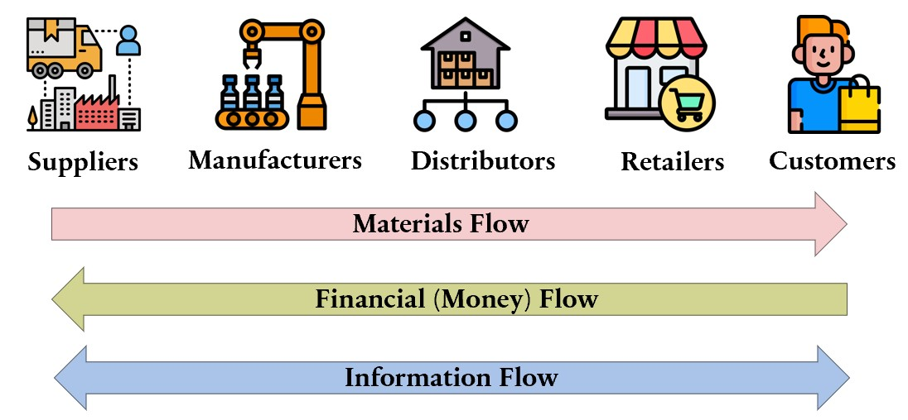{width=88% fig-align="center"}

:::{.fragment}
<b>Logistics</b> is the process of coordinating the efficient flow of goods, services, and related information. It involves planning, implementing, and controlling the movement and sometimes warehousing of goods throughout the supply chain. Logistics is a critical component that holds the supply chain together.
:::

::: notes

- On this slide, we can see the structure of a typical SC network and 3 key flows that connect all participants.
At the top, we have the main supply chain actors: Suppliers –  provide raw materials or components; Manufacturers – convert raw materials into finished products; Distributors – store and transport products in bulk; Retailers – sell products to end users; Customers – The final consumers of the product.

- Now let’s look at the three major flows that link these entities: 

- First, the Materials Flow.
This moves from left to right — starting with suppliers and ending with customers. It represents the physical movement of raw materials, components, and finished goods across the supply chain.

- Second, the Financial or Money Flow.
This moves in the opposite direction — from customers back to suppliers. Customers pay retailers, retailers pay distributors, distributors pay manufacturers, and manufacturers pay suppliers. This backward flow represents payments, credit terms, and financial transactions.

- Third, the Information Flow.
This flow moves in both directions. Information includes demand forecasts, order details, inventory levels, delivery status, and production schedules. Effective information sharing is critical because it coordinates activities and reduces uncertainty across the supply chain.

:::

---

### 1.3 Roles of Logistics in Supply Chain

:::: columns
::: {.column width="20%"}

{width=80% fig-align="center"}

<div style="text-align: center;">
<b>Transportation management</b>

Planning, organising, and executing movement of goods from one place to another.
</div>

:::

:::  {.column width="20%" .fragment}
{width=80% fig-align="center"}

<div style="text-align: center; color: blue;">
<b>Warehousing & inventory management</b>

Managing inventory levels, storing, and retrieving products
</div>
:::

::: {.column width="20%" .fragment}
{width=80% fig-align="center"}

<div style="text-align: center;">
<b>Order fulfillment</b>

Handling customer orders from initial receipt to delivery. (Customer services)
</div>
:::

::: {.column width="20%" .fragment}
{width=80% fig-align="center"}
<div style="text-align: center; color: blue">
<b>Packaging</b>

Designing, producing, and delivering packaging materials and supplies to warehouses
</div>
:::

::: {.column width="20%" .fragment}
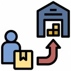{width=80% fig-align="center"}

<div style="text-align: center;">
<b>Reverse logistics</b>

Returning goods to their original manufacturer after they have been used.
</div>
:::

::::

---

### Static Facilities in Supply Chain

::: {.small-table}

| Facility | Roles in the SC  | Operations          |
| --------- | --------- | --------------------------------------------- |
| **Plant/Factory**       | Supplier/Manufacturer     | Produces or manufactures goods                                                                               |
| **Warehouse**           | Distributor               | Stores and holds inventory; often receives shipments from suppliers                                          |
| **Distribution Centre** | Distributor/Wholesaler    | Receives, processes, and sends out orders to customers                                                       |
| **Fulfillment Centre**  | Distributor               | Reorders and prepares products for shipping to customers                                                     |
| **Cross Dock**          | Distributor               | Direct transfer of goods from vehicles to vehicles                                                           |
| **Locker**              | Distributor               | Stores non-perishable materials temporarily while being moved between facilities (e.g., inventory, shipping) |
| **Service Outlet**      | Retailer/Service Provider | Provides value-added services to customers (e.g., repair, maintenance, consulting)                           |
| **Parking Lot**         | Dispatcher                | Supports the movement of personnel and vehicles within the facility                                          |
| **Collection Centre**   | Collector                 | Collects and stores waste materials or hazardous goods temporarily until disposal                            |
| **Disposal Centre**     | Disposer                  | Handles the removal and destruction of unwanted or hazardous materials                                       |

: {.striped}

:::

::: notes
- This slide lists the static facilities commonly found in supply chains, along with their roles and operations.
- Fulfillment centre: small distribution hubs located at various locations to improve delivery speed and customer service. They receive products from manufacturers or warehouses, process orders, and prepare items for shipping to customers.
:::

---

### 1.4 Supply Chain Management (SCM)

The process of integrating, planning, sourcing, manufacturing, and delivering products from raw materials to end customers, while measuring and evaluating **key performance indicators (KPIs)** to ensure customer satisfaction and profitability. 

[]{.space-out}

:::: {.columns}

::: {.column .fragment width="50%"}

### SCM Pyramid

This performance management framework is often represented by the **SCM Pyramid**, which illustrates the hierarchy of SC objectives and performance metrics.

1. Strategy (Long-term, Top)
2. Planning (Medium-term, Middle)
3. Operations (Short-term, Base)
:::

::: {.column .fragment width="50%"}
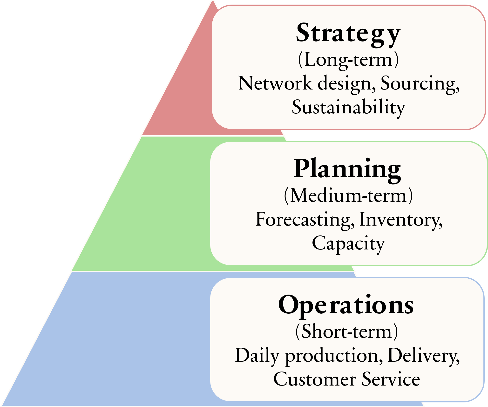{width=100% fig-align="center"}
:::


::::


::: notes

- SCM is essential for ensuring efficient delivery of products and services, reducing costs, and maintaining quality.

- We can understand SCM as a three-level pyramid.

- At the top is **Strategy**, which focuses on long-term decisions like network design, sourcing, and sustainability. These decisions shape the overall supply chain structure.

- In the middle is **Planning**, which involves forecasting demand, managing inventory, and balancing capacity. Planning connects strategy with day-to-day activities.

- At the base is **Operations**, which covers daily production, order fulfillment, and delivery execution.

- For SCM to be successful, these three levels must work together. Companies like Amazon and Zara succeed because they align long-term strategy, seasonal planning, and efficient daily operations.

- In short, effective SCM integrates strategy, planning, and operations to create competitive advantage.

:::

---

#### 1.4.1 Strategy (Long-term)

:::: {.columns}
::: {.column width=50%}
<br>

- Aligns with competitive strategy
- Efficiency vs. Responsiveness
- Network design
- Make-or-buy decisions
- Sustainability & risk management
:::
::: {.column width=50%}
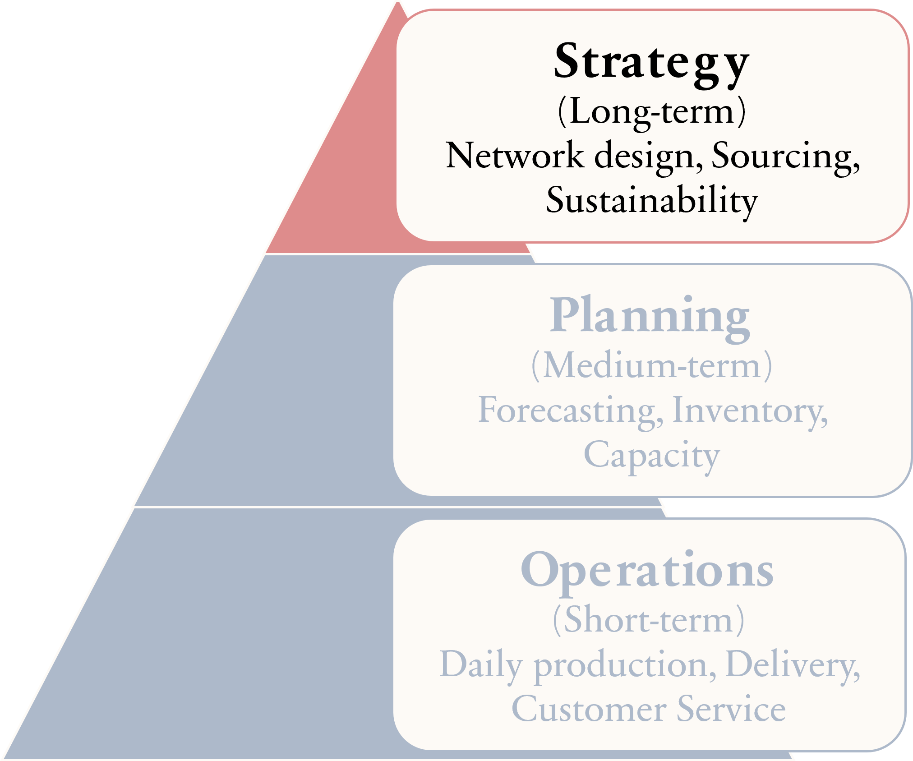{width=85% fig-align="center"}
:::
::::

::: {.fragment}
<span style="color: blue;">**Example**</span> IKEA focuses on cost efficiency and flat-pack design to reduce logistic costs.

{width=20% fig-align="center"}
:::

::: {.notes}
- This slide explains the strategic, long-term level of SCM.

- SC strategy must align with the company’s overall competitive strategy. 

- If a company competes on low cost, its SC should focus on efficiency. If it competes on speed or customization, it should focus more on responsiveness.

- Key strategic decisions include network design — such as where to locate factories and warehouses 

- Make-or-buy decisions, meaning whether to produce internally or outsource.

- Sustainability and risk management are also important at this level.

- For example, IKEA supports its low-cost strategy through flat-pack designs, which reduce transportation and logistics costs.

:::

---

#### 1.4.2 Planning (Medium-term)

:::: {.columns}
::: {.column width=50%}
<br>
- Demand forecasting
- Aggregate & capacity planning
- Inventory planning
- Sales & Operations Planning (S&OP)
- Distribution & procurement planning
:::
::: {.column width=50%}
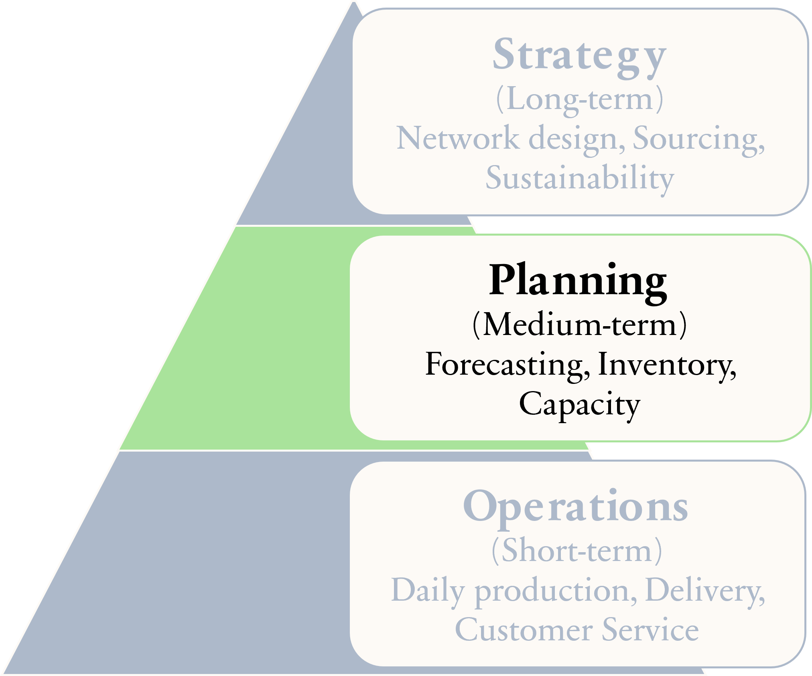{width=85% fig-align="center"}
:::
::::

::: {.fragment}
<b style="color: blue;">Example</b> Kmart uses demand forecasts to plan inventory before holiday seasons

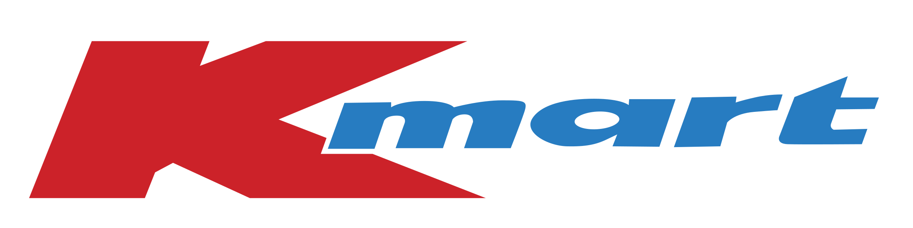{width=25% fig-align="center"}

:::

:::{.notes}
- This slide focuses on the planning level of SCM, which is medium-term. Planning connects long-term strategy with daily operations.

- One key activity is demand forecasting, where companies predict future customer demand.

- Based on forecasts, companies conduct aggregate and capacity planning to ensure they have enough production resources.

- They also perform inventory planning to determine how much stock to hold and where to store it.

- Another important process is Sales and Operations Planning, or S&OP, which aligns sales forecasts with production and supply capabilities.

- Finally, planning includes distribution and procurement decisions, ensuring products and materials are available at the right time and place.

- For example, Kmart uses demand forecasts to increase inventory before holiday seasons to meet higher customer demand.

:::

---

#### 1.4.3 Operation (Short-term)

:::: {.columns}
::: {.column width=50%}
<br>

- Order management
- Production scheduling
- Inventory & warehouse operations
- Transportation & logistics
- Quality & reverse logistics
:::

::: {.column width=50%}
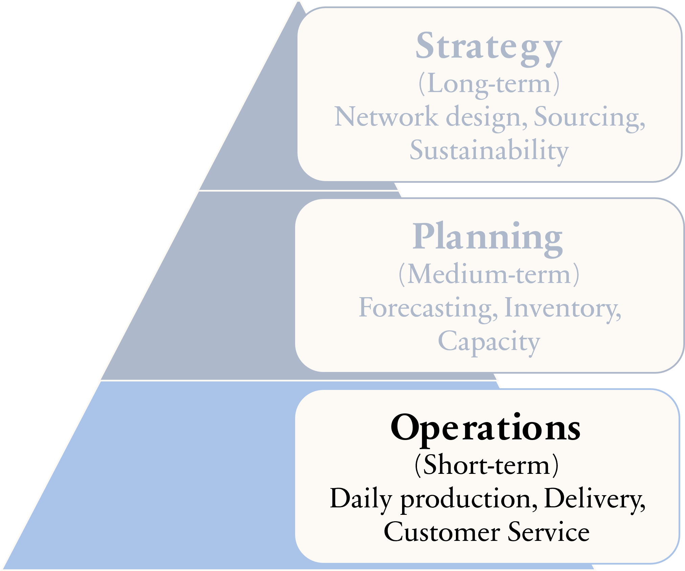{width=85% fig-align="center"}
:::
::::

::: {.fragment}
<b style="color: blue;">Example</b> McDonald’s manages daily food deliveries to ensure freshness

{width=15% fig-align="center"}
:::

:::{.notes}
- This slide focuses on the operational, short-term level of SCM. Operations deal with daily execution activities.

- This includes order management, which ensures customer orders are processed accurately and on time.

- It also involves production scheduling, where companies decide what to produce and when.

- Another key area is inventory and warehouse operations, managing stock levels and storage efficiently.

- Operations also cover transportation and logistics, ensuring products are delivered quickly and cost-effectively.

- Finally, it includes quality management and reverse logistics, such as handling returns and defective products.

- For example, McDonald’s manages daily food deliveries worldwide to ensure freshness and consistent quality.

:::

---

### 1.5 Push vs. Pull Strategy in SC Management

Supply chains can be managed using push, pull, or a hybrid (push–pull) strategy, depending on how demand information is used.

::: {.fragment}
#### 1.5.1 Push Strategy
A push strategy is driven by demand forecasts. Products are produced and distributed in advance, before actual customer orders are received.
:::

::: {.fragment}
**Key Characteristics**
:::

- Based on forecasted demand
- Production starts before customer orders
- Suitable for stable and predictable demand
- Focuses on high capacity utilization and low cost


:::{.notes}
- This slide introduces Push versus Pull strategies in SCM. SC can be managed using a push strategy, a pull strategy, or a hybrid approach, depending on how demand information is used.

- Let’s first focus on the Push Strategy.

- A push strategy is driven by demand forecasts. Companies produce and distribute products in advance, before receiving actual customer orders.

- The key characteristics are:

- First, it is based on forecasted demand.

- Second, production starts before customer orders are placed.

- Third, it is most suitable for stable and predictable demand.

- Finally, it focuses on high capacity utilization and low production costs, often benefiting from economies of scale.

- In summary, a push strategy highlights efficiency and cost reduction, but it depends heavily on the accuracy of demand forecasts.”
:::

---

:::: columns

::: {.column width="50%" .fragment}
**Advantages**

- Economies of scale
- Lower production costs
- Efficient for mass production

:::

::: {.column width="50%" .fragment}
**Disadvantages**

- Risk of overproduction
- High inventory holding costs
- Less responsive to demand changes

:::

::::

::: {.fragment}
**Example**

:::

- Consumer packaged goods (e.g., canned food, detergents)
- Traditional manufacturing with long lead times

:::{.notes}
- Now let’s look at the advantages and disadvantages of the push strategy.

- Starting with the advantages:

- Push systems benefit from economies of scale, since large production batches reduce the cost per unit.

- They also lead to lower production costs due to efficient resource utilization.

- This approach is highly efficient for mass production, especially when demand is stable and predictable.

- However, there are also disadvantages.

- There is a risk of overproduction if forecasts are inaccurate.

- It can result in high inventory holding costs, because products are produced before actual demand is confirmed.

- And finally, push systems are less responsive to sudden demand changes.

- Typical examples include consumer packaged goods, such as canned food or detergents, 

- and traditional manufacturing industries with long lead times.

- In summary, push strategy works best in stable environments but carries forecasting risks.”
:::

---

::: {.fragment}
#### 1.5.2 Pull Strategy
A pull strategy is driven by actual customer demand. Products are produced only after an order is received.

:::

::: {.fragment}
**Key Characteristics**
:::

- Based on real customer orders
- Production starts after demand is known
- Suitable for uncertain or customized demand
- Focuses on responsiveness and flexibility

:::{.notes}

- Now let’s look at the Pull Strategy.

- Unlike the push strategy, a pull strategy is driven by actual customer demand. Products are produced only after a customer order is received.

- The key characteristics are:

- First, it is based on real customer orders rather than forecasts.

- Second, production starts only after demand is confirmed.

- Third, it is suitable for uncertain, variable, or customized demand.

- And finally, it focuses on responsiveness and flexibility rather than cost efficiency.

- This approach reduces the risk of overproduction and excess inventory, but it may require flexible production systems and shorter lead times.

- In summary, the pull strategy prioritizes responsiveness and customer satisfaction, especially in dynamic or customized markets.”

:::

---

:::: columns

::: {.column width="50%" .fragment}
**Advantages**

- Lower inventory levels
- Reduced risk of excess stock
- High customer satisfaction


:::

::: {.column width="50%" .fragment}
**Disadvantages**

- Higher unit costs
- Requires fast response and flexible systems
- Possible delays if capacity is limited


:::

::::

::: {.fragment}
**Example**

:::

- Custom-made products
- Dell’s build-to-order computers
- Fast fashion (partially pull-based)

:::{.notes}
Now let’s examine the advantages and disadvantages of the pull strategy.

- Starting with the advantages:

- Pull systems maintain lower inventory levels, since production begins only after receiving customer orders.

- This leads to a reduced risk of excess stock and expiry.

- It also improves customer satisfaction, especially when products are customized to specific needs.

- However, there are also disadvantages.

- Pull systems often have higher unit costs, because they do not benefit as much from economies of scale.

- They require fast response times and flexible production systems.

- And if capacity is limited, there may be delays in fulfilling orders.

- Examples include custom-made products, Dell’s build-to-order computers, and parts of the fast fashion industry, which combine pull elements to respond quickly to trends.

- In summary, pull strategy increases responsiveness but may involve higher costs and operational complexity.”
:::

---

::: {.fragment}
#### 1.5.3 Push–Pull Strategy (Hybrid)

:::

- Upstream activities (suppliers, manufacturing) use push
- Downstream activities (final assembly, distribution) use pull


::: {.fragment}
<div style="color: blue;">
<b>Example : Apple</b>
</div>
:::

::: {.fragment}
**Push**

:::

  - Component sourcing based on forecasts
  - Large-scale manufacturing

::: {.fragment}
**Push-Pull Boundary**

:::

  - Final assembly & regional distribution

::: {.fragment}
**Pull Boundary**

:::

  - Customer demand via online & retail stores 


:::{.notes}
- This slide explains the Push–Pull Strategy, also known as the hybrid strategy. In this approach, part of the supply chain operates under a push system, while the other part operates under a pull system.

- Typically, upstream activities, such as suppliers and large-scale manufacturing, use a push approach based on demand forecasts.

- Meanwhile, downstream activities, such as final assembly and distribution, use a pull approach based on actual customer demand.

- The key concept here is the push–pull boundary. Before this boundary, activities are forecast-driven.
After this boundary, activities are demand-driven.

- For example, Apple uses this hybrid model.

- It sources components and conducts large-scale manufacturing based on forecasts — this is the push part.

- However, final assembly and regional distribution respond more closely to actual customer demand — this is the pull part.

- In summary, the push–pull strategy combines efficiency upstream with responsiveness downstream.

:::

---

::: {.fragment}
<div style="color: blue;">
<b>Example : Toyota</b>
</div>

:::

- Push for parts production, pull for assembly using Just-In-Time.

::: {.fragment}
**Push** (Forecast-driven upstream):

:::

  - Suppliers → Parts Production
  

::: {.fragment}
**Push-Pull Boundary**

:::

  - Assembly Plants (Just-In-Time)


::: {.fragment}
**Pull** (Demand-driven downstream)

:::

  - Distribution → Dealers → Customers

::: {.fragment}
<div style="color: red;">
<b>Flow Diagram</b>
</div>
:::

  - Suppliers → Parts → Assembly Plants → Distribution → Dealers → Customers
        PUSH   &nbsp;&nbsp;&nbsp;&nbsp;&nbsp;&nbsp;&nbsp;  PUSH &nbsp;&nbsp;&nbsp;&nbsp; BOUNDARY &nbsp;&nbsp;&nbsp;&nbsp;&nbsp;&nbsp;&nbsp;&nbsp;&nbsp;&nbsp;  PULL &nbsp;&nbsp;&nbsp;&nbsp;&nbsp;&nbsp;&nbsp;&nbsp;&nbsp;&nbsp;&nbsp;&nbsp; PULL &nbsp;&nbsp;&nbsp;&nbsp;&nbsp;&nbsp;&nbsp;&nbsp; PULL    

:::{.notes}
- Toyota applies a hybrid approach. It uses push for parts production and pull for final assembly through its Just-In-Time, or JIT, system.

- Upstream, in the push stage, suppliers produce parts based on forecasts. This ensures efficiency and stable production.

- The push–pull boundary occurs at the assembly plants. Here, Toyota applies Just-In-Time principles, meaning parts arrive exactly when needed for assembly.

- Downstream, the system becomes pull-based. Distribution to dealers and final sales to customers are driven by actual demand.

- So the flow is: Suppliers to parts production — push.

- Assembly plants — the boundary.

- Then distribution, dealers, and customers — pull.

- In summary, Toyota combines forecast-driven efficiency upstream with demand-driven responsiveness downstream, achieving both cost control and flexibility.
:::


---

### 1.6 Case Studies

#### Manufacturing Case: Toyota

::: {.block data-title="Problem" .fragment}
High inventory cost & production inefficiencies
:::

::: {.block data-title="Decision" .fragment}
Implement Just-In-Time (JIT) and lean supply chain strategy
:::

::: {.block data-title="Outcome" .fragment}
Reduced inventory, faster production cycles, lower costs
:::

<br>

::: {.fragment}
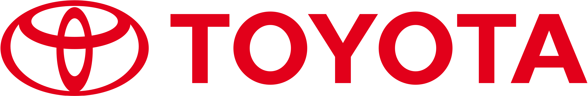{width=30% fig-align="center"}
:::

:::{.notes}
- This slide presents Toyota’s manufacturing case study.

- The problem was high inventory costs and production inefficiencies, which increased expenses and reduced flexibility.

- Toyota’s decision was to implement Just-In-Time, or JIT, along with a lean supply chain strategy. This approach focuses on producing and delivering parts only when they are needed, reducing waste.

- The outcome was lower inventory levels, faster production cycles, and reduced costs.

- In summary, Toyota improved efficiency and competitiveness by adopting a lean, demand-driven production system.

:::

---

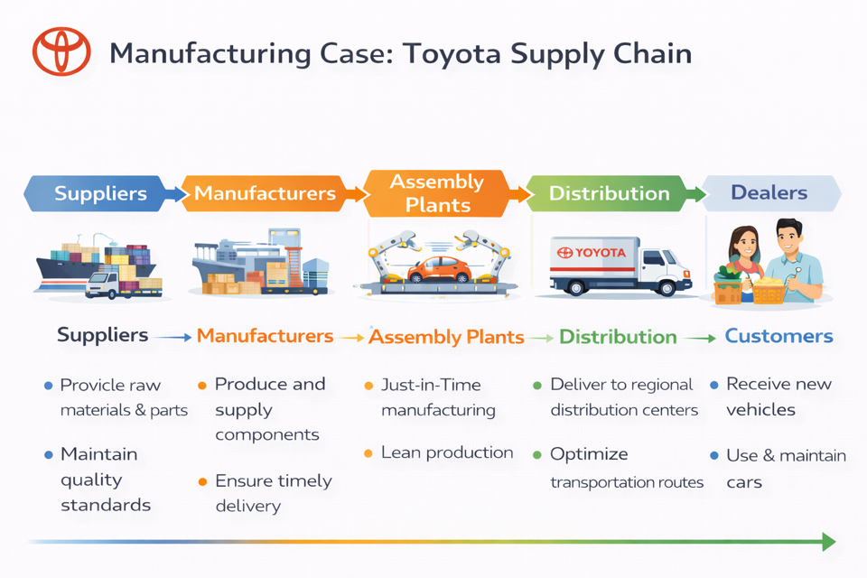{width=100% fig-align="center"}

:::{.notes}
This slide shows the overall structure of Toyota’s supply chain, from suppliers to customers.

It begins with suppliers, who provide raw materials and parts while maintaining strict quality standards.

Next are the manufacturers, who produce and supply components, ensuring timely delivery to the next stage.

At the assembly plants, Toyota applies Just-In-Time and lean production principles. Parts arrive exactly when needed, reducing inventory and eliminating waste.

After assembly, vehicles move to distribution centers, where Toyota optimizes transportation routes to ensure efficient delivery.

Then vehicles are sent to dealers, and finally to customers, who receive, use, and maintain their cars.

Overall, this flow demonstrates how Toyota integrates quality control, lean manufacturing, and efficient distribution to create a highly coordinated and cost-effective supply chain.”
:::
---

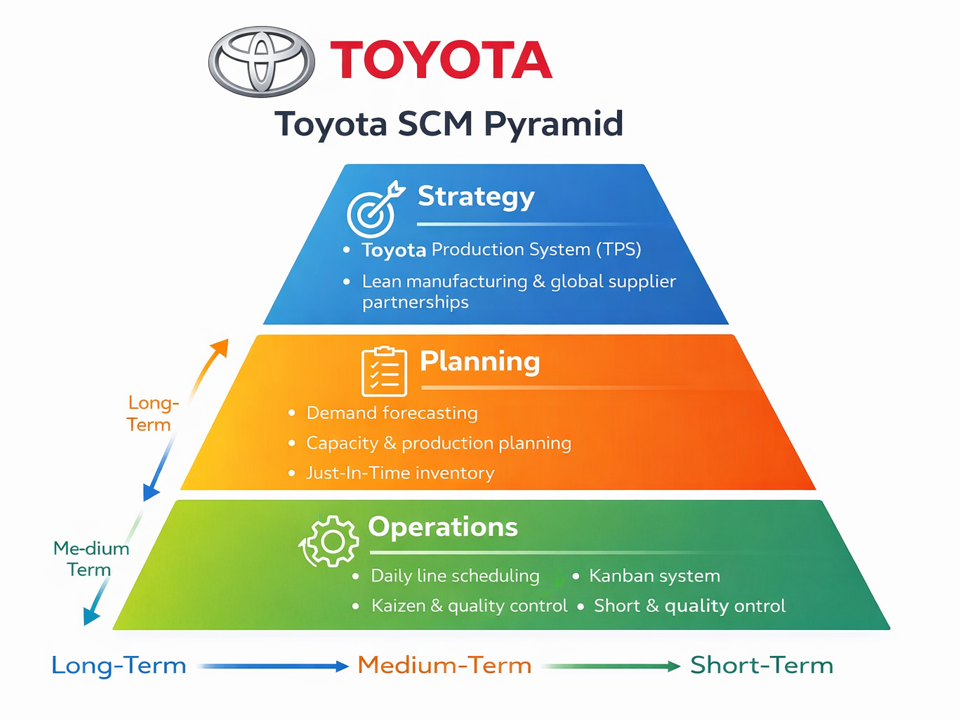{width=100% fig-align="center"}


:::{.notes}
This slide presents Toyota’s SCM Pyramid, showing how strategy, planning, and operations are aligned.

At the top is Strategy, which focuses on long-term direction.
Toyota’s strategy is built around the Toyota Production System, or TPS, lean manufacturing, and strong global supplier partnerships. This sets the foundation for efficiency and continuous improvement.

In the middle is Planning, which operates at the medium-term level.
This includes demand forecasting, capacity and production planning, and Just-In-Time inventory management. Planning ensures that supply matches expected demand.

At the base is Operations, which focuses on short-term daily activities.
This includes daily line scheduling, the Kanban system, Kaizen continuous improvement, and strict quality control.

- Kanban is a visual pull system that controls production and inventory by producing only what is needed, when it is needed, and in the amount needed.

- Kaizen is a philosophy of continuous, small improvements involving everyone to enhance efficiency, quality, and productivity over time.

Overall, the pyramid shows how Toyota integrates long-term strategy, medium-term planning, and short-term operations into one coordinated system.

:::

---

Toyota SCM Timeline

::: {.block .blue data-title="LONG-TERM (Strategy – Years)" .fragment}
- Plant location
- Supplier selection
- Technology investment
:::

::: {.block .green data-title="MEDIUM-TERM (Planning – Months)" .fragment}
- Production volume planning
- Capacity & workforce planning

:::

::: {.block .red data-title="SHORT-TERM (Operations – Daily)" .fragment}
- Line scheduling
- Quality checks
- On-time delivery
:::


:::{.notes}
This slide shows Toyota’s SCM timeline across three levels.

At the long-term strategic level, Toyota decides on plant locations, selects suppliers, and invests in technology. These decisions shape the supply chain for years.

At the medium-term planning level, Toyota plans production volumes and manages capacity and workforce to match expected demand.

At the short-term operational level, the focus is on daily line scheduling, quality checks, and ensuring on-time delivery.

Overall, Toyota aligns long-term strategy, monthly planning, and daily operations to maintain efficiency and competitiveness.
:::

---

#### Retail Case: Kmart

::: {.block data-title="Problem" .fragment}
Demand variability and stockouts across stores
:::

::: {.block data-title="Decision" .fragment}
Advanced demand forecasting & centralized planning
:::

::: {.block data-title="Outcome" .fragment}
High product availability with low inventory costs
:::

<br>

::: {.fragment}
{width=30% fig-align="center"}
:::

:::{.notes}
This slide presents the Kmart retail case.

The main problem was demand variability and stockouts across stores, leading to lost sales and inefficient inventory levels.

Kmart’s decision was to implement advanced demand forecasting and centralized planning to improve coordination and visibility.

The outcome was higher product availability with lower inventory costs.

In summary, better forecasting and centralized control helped Kmart balance supply and demand more effectively while improving customer service.
:::

---

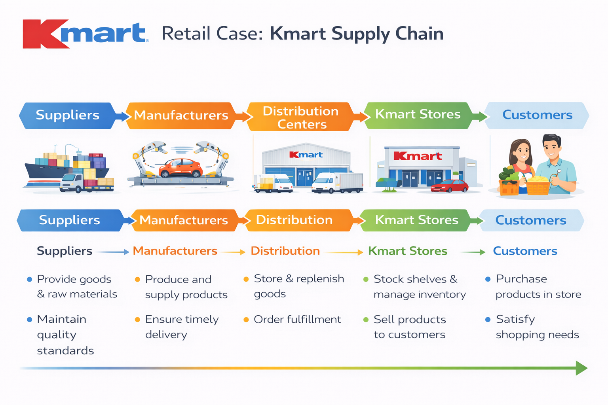{width=100% fig-align="center"}

:::{.notes}
This slide illustrates Kmart’s supply chain from suppliers to customers.

Suppliers provide goods and raw materials to manufacturers, who produce and deliver finished products.

These products move to distribution centers, where they are stored and prepared for replenishment.

Next, goods are sent to Kmart stores, where inventory is managed and products are sold.

Finally, customers purchase the products to meet their needs.

Overall, effective coordination across suppliers, distribution centers, and stores ensures product availability and smooth retail operations.
:::

---

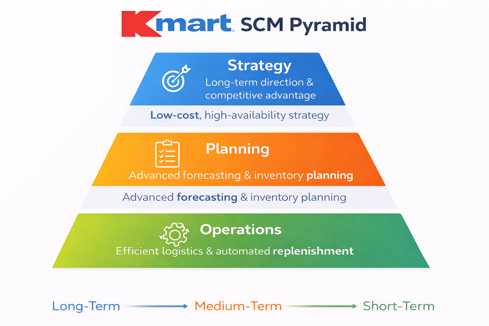{width=100% fig-align="center"}

:::{.notes}
This slide presents Kmart’s Supply Chain Management pyramid, showing how strategy, planning, and operations are aligned.

At the top is Strategy, which focuses on long-term direction and competitive advantage.
Kmart follows a low-cost, high-availability strategy, aiming to offer affordable products while keeping shelves well stocked.

In the middle is Planning, which operates at the medium-term level.
Kmart uses advanced demand forecasting and inventory planning to better predict customer demand and manage stock levels efficiently.

At the base is Operations, which focuses on short-term daily execution.
This includes efficient logistics and automated replenishment systems to ensure products are delivered to stores on time.

Overall, the pyramid shows how Kmart connects long-term strategy, data-driven planning, and efficient operations to improve product availability while controlling costs.
:::

---

#### Healthcare Case: Hospital Supply Chain

::: {.block data-title="Problem" .fragment}
Shortages of critical medical supplies

:::

::: {.block data-title="Decision" .fragment}
Strategic supplier partnerships & safety stock planning
:::

::: {.block data-title="Outcome" .fragment}
Improved patient care and reduced emergency shortages
:::


::: {.fragment}
{width=20% fig-align="center"}
:::

:::{.notes}
This slide presents a healthcare case focusing on a hospital supply chain.

The problem was shortages of critical medical supplies, which directly affected patient care and emergency response.

The decision was to establish strategic supplier partnerships and implement proper safety stock planning. By working closely with reliable suppliers and maintaining buffer inventory for essential items, the hospital reduced supply risks.

The outcome was improved patient care and fewer emergency shortages. Critical supplies became more consistently available, especially during high-demand situations.

In summary, better supplier collaboration and inventory planning strengthened the hospital’s supply chain and enhanced service quality.”
:::

---

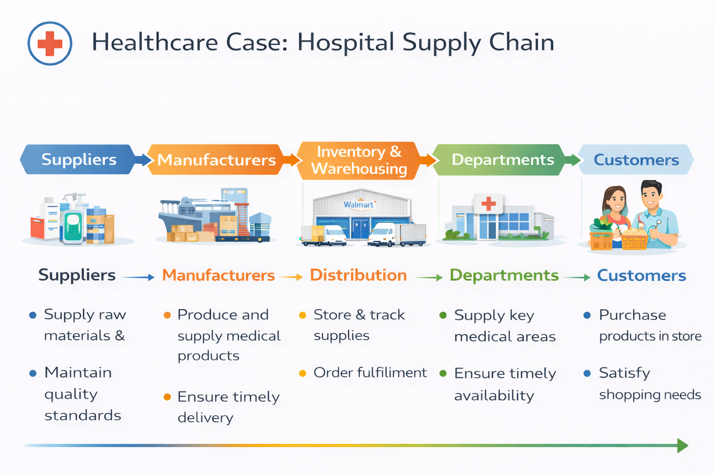{width=100% fig-align="center"}

:::{.notes}
This slide shows the hospital supply chain from suppliers to patients.

Suppliers provide raw materials, and manufacturers produce medical products while ensuring quality and timely delivery.

These products move to inventory and warehousing, where supplies are stored and tracked.

They are then distributed to hospital departments, such as emergency and surgical units, to ensure timely availability.

Finally, patients receive care supported by these supplies.

Overall, the hospital supply chain focuses on reliability, quality, and availability, since shortages can directly affect patient safety.
:::

---

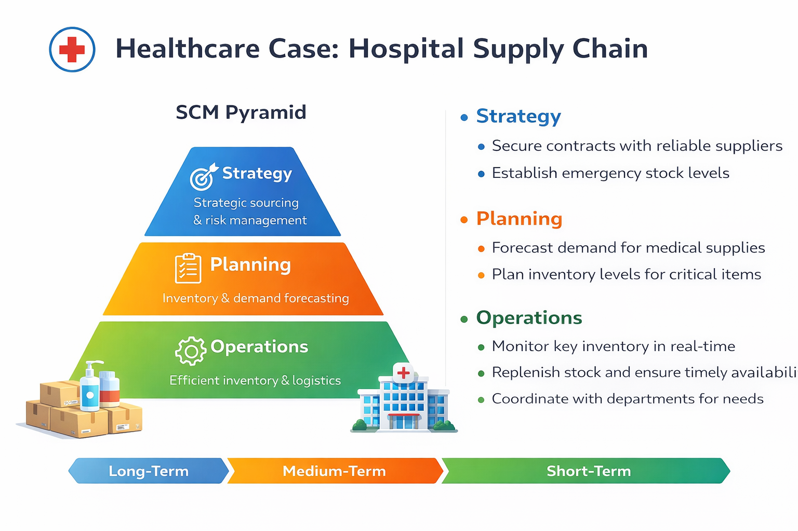{width=100% fig-align="center"}

:::{.notes}
This slide presents the hospital’s Supply Chain Management pyramid, showing how strategy, planning, and operations are aligned.

At the top is Strategy, which focuses on long-term decisions.
Hospitals secure contracts with reliable suppliers and establish emergency stock levels to manage risk and ensure supply continuity.

In the middle is Planning, which operates at the medium-term level.
This includes forecasting demand for medical supplies and planning inventory levels for critical items such as medicines and surgical equipment.

At the base is Operations, which focuses on daily activities.
Hospitals monitor key inventory in real time, replenish stock as needed, and coordinate closely with departments to ensure timely availability.

Overall, this pyramid shows how strategic sourcing, careful planning, and efficient daily operations work together to support patient care and reduce supply shortages.”

:::


---

### 1.7 Supply Chain Network Design

Supply chain network design is the strategic configuration of a supply chain with the following objectives.

- Minimise total supply chain cost
- Reduce lead time
- Improve customer service
- Optimise inventory and resources
- Increase coordination across the supply chain
- Maximise overall supply chain profitability

:::{.notes}
Supply chain network design refers to the strategic configuration of the supply chain — meaning decisions about the number, location, and capacity of facilities such as factories, warehouses, and distribution centers.

The main objective is to minimize total supply chain cost, including production, transportation, and inventory costs.

At the same time, companies aim to reduce lead time, so customers receive products faster.

Another goal is to improve customer service, ensuring high product availability and reliability.

Network design also helps optimize inventory and resources, avoiding excess stock or underutilized capacity.

It improves coordination across different supply chain partners 

and ultimately aims to maximize overall profitability.
:::

---

The following factors affect network design:

:::: columns
::: {.column}

- Demand Forecasting
- Location of Facilities
- Inventory Management
- Network Capacity
- Supplier & Vendor 
- Management
- Customer Service Levels
- Technology & Information Systems
:::

::: {.column}
- Regulatory & Compliance
- Cost Analysis
- Risk Management
- Sustainability & Environmental Impact
- Competitive Factors
- Market Dynamics
- Globalisation

:::
::::

---

## 2. Review of Optimisation Problems

::: {.block data-title="Definition" .fragment}
Optimisation is the mathematical discipline that deals with maximising and minimising functions under certain conditions or constraints.
:::

- These functions are called objective functions.
- There are 2 types of optimisation problems, depending on whether there is constraint on the decision variables $x$ and $y.$

:::: columns

::: {.column width="40%" .fragment}

<div style="text-align: center;">
**Unconstrained optimisation**
</div>
$$\min f(x,y) = x^2+2y^2 $$
:::

::: {.column width="60%" .fragment}
<div style="text-align: center;">
**Constrained optimisation**
</div>
$$\min f(x,y) = x^2 + 2y^2 $$
$$-2<x<5,\, y \ge 1$$
:::

::::

---

:::: {.columns}
::: {.column width="50%" .fragment}

```{python}
#| code-fold: true

import numpy as np
import matplotlib as mpl
import matplotlib.pyplot as plt

mpl.rcParams['font.size'] = 14 

x = np.linspace(-5, 5, 200)
y = np.linspace(-5, 5, 200)
X, Y = np.meshgrid(x, y)

Z = X**2 + 2*Y**2

fig = plt.figure()
ax=fig.add_subplot(projection='3d')
ax.plot_surface(X, Y, Z)

ax.set_xlabel("X")
ax.set_ylabel("Y")
ax.set_zlabel("Z")
ax.set_title("f(x, y) = x² + 2y²")

plt.show()
```

:::
::: {.column width="50%" .fragment}
```{python}
#| code-fold: true

x = np.linspace(-2, 5, 200)
y = np.linspace(0, 5, 200)
X, Y = np.meshgrid(x, y)

Z = X**2 + 2*Y**2

fig = plt.figure()
plt.contour(X, Y, Z, levels=50)
plt.xlabel("X")
plt.ylabel("Y")
plt.title("f(x, y) = x² + 2y², x ∈ (-2, 5), y ∈ (0, ∞)")
plt.show()
```

:::
::::

:::{.notes}
The code in the image is importing Python libraries commonly used for numerical computation and data visualization:

```python
import numpy as np
import matplotlib as mpl
import matplotlib.pyplot as plt
```

### What Each Line Means

1. **`import numpy as np`**

   * Imports the **NumPy** library.
   * `np` is a common alias used for convenience.
   * NumPy is used for numerical operations, arrays, matrices, and mathematical functions.

2. **`import matplotlib as mpl`**

   * Imports the main **Matplotlib** library.
   * `mpl` is a shorthand alias.
   * It provides plotting and visualization functionality.

3. **`import matplotlib.pyplot as plt`**

   * Imports the **pyplot** module from Matplotlib.
   * `plt` is the standard alias.
   * Pyplot is used to create graphs such as line charts, bar charts, scatter plots, etc.

---

### Simple Explanation

* **NumPy (`np`)** → For calculations and numerical data
* **Matplotlib (`plt`)** → For plotting and visualizing data

These imports are typically used together when analyzing and visualizing data in Python.
:::

---

### 2.1 Local Maximum and Minimum

:::: columns
::: {.column .block .yellow width="30%" .fragment}
<div style="text-align: center;">
**First order**
</div>

$$
\begin{align*}
&f'(x^*) = 0,\\
x^* \,&\text{is the critical point}
\end{align*}
$$

<br>

:::
::: {.column .block .green width="60%" .fragment}
<div style="text-align: center;">
**Second order**
</div>

$$
\begin{align*}
f''(x^*)<0, \; &x^* \text{is (local) max.}\\
f''(x^*)>0, \; &x^* \text{is (local) min.}\\
f''(x^*)=0, \; &x^* \text{can be max, min or neither.}
\end{align*}
$$
:::
::::

::: {.fragment}
**Example.** Find the local max and min points of  $f(x)=x^3-6x^2+9x$
:::

:::: columns
::: {.column width="40%" .fragment}

$$
\begin{align*}
f'(x)=3x^2-12x+9 &= 0 \\
3(x^2-4x+3) &= 0 \\
3(x-3)(x-1) &= 0 \\
x^* &= 1, 3 
\end{align*}
$$

::: {.fragment}
$$
f(1)=4 \rightarrow (1,4), \; f(3)=0 \rightarrow (3,0)
$$

:::


:::

::: {.column width="60%" .fragment}
$$
\begin{align*}
f''(x) &= 6x-12=6(x-2) \\
f''(1) &= -6 < 0 \\
        &\rightarrow \textbf{local max at } (1,4) \\
f''(3) &= 6 > 0 \\
        &\rightarrow \textbf{local min at } (3,0)
\end{align*}
$$
:::

::::

:::{.notes}
This slide explains how to find local maximum and minimum points using first and second derivatives.

First, the first-order condition:
We set the first derivative equal to zero, f'(x*)= 0, The values of x* are called critical points.

Next, we apply the second-order condition: f''(x*) < 0, the point is a local maximum.

If f''(x*) > 0, the point is a local minimum.

If f'''(x*) = 0, the test is inconclusive.

Now, let’s look at the example:

:::

---

```{python}
#| code-fold: true
#| code-summary: "Finding critical points of f(x) = x³ - 6x² + 9x"
import numpy as np
import matplotlib as mpl
import matplotlib.pyplot as plt

mpl.rcParams['font.size'] = 18 

# Define the function
def f(x):
    return x**3 - 6*x**2 + 9*x

# Generate x values
x = np.linspace(-1, 5, 400)
y = f(x)

x_crit = np.array([1, 3])
y_crit = x_crit**3 - 6*x_crit**2 + 9*x_crit

x_crit, y_crit
```

<br>

```{python}
#| code-fold: true
#| code-summary: "Plotting f(x) and its critical points"
#| fig-align: "center"
# Plot
plt.figure(figsize=(6,4))
plt.plot(x, y)
plt.scatter(x_crit, y_crit, s=150, color='red', zorder=3)
plt.xlabel("x")
plt.ylabel("f(x)")
plt.title("f(x) = x³ - 6x² + 9x")
plt.grid(True)

plt.show()
```

::: {.fragment .center}
Are these the ultimate maximum and minimum of the function $f(x)$?
:::


---

### 2.2 Global Maximum and Minimum

:::: columns

::: {.column width="45%" .fragment}

Optima can occur in the three places:

1. The boundary of the domain
2. A non-differentiable point
3. A point $x^∗$ with $\nabla f(x^*)=0.$
<br>
(i.e. $f'(x^*)=0$ for 1D)
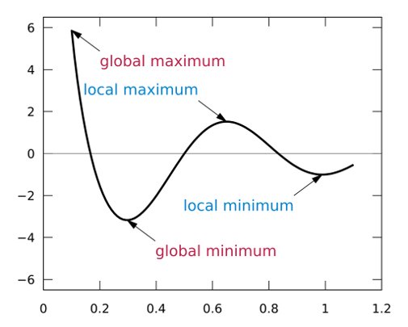{width=92% fig-align="center"}

:::

::: {.column width="55%" .fragment}
<br>

Then,

- A local maximum is a point that $f(x^*) \geq f(x), \forall x\,$ in some open interval containing $x^*.$

- A local minimum is a point that $f(x^*) \leq f(x), \forall x\,$ in some open interval containing $x^*.$

- A global maximum is a point that $f(x^*) \geq f(x), \forall x\,$ in the domain of $f.$

- A global minimum is a point that $f(x^*) \leq f(x), \forall x\,$ in the domain of $f.$
:::

::::


---

From the second derivatives, we can conclude that

::: {.block .green}
- When $f''(x) \geq 0, \forall x,$ i.e., $f(x)$ is a <b>convex</b> function, then the local minimum $x^*$ is the <b>global minimum</b> of $f(x).$
:::

::: {.block .red}
- When $f''(x) \leq 0, \forall x,$ i.e., $f(x)$ is a <b>concave</b> function, then the local maximum $x^*$ is the <b>global maximum</b> of $f(x).$
:::

::: {.fragment}
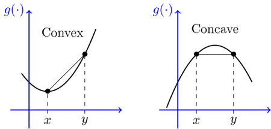{width=50% fig-align="center"}
:::

---

**Example.** Find the local and global maximum and minimum points of the function $f(x)=x^3+3x^2-2x+1$ for $x \in [-4,2]$


:::: columns

::: {.column width="45%" .fragment}
$$f'(x)=3x^2+6x-2=0$$

::: {.fragment}
$$
\begin{align*}
x &= \frac{-b \pm \sqrt{b^2-4ac}}{2a} \\
  &= \frac{-6 \pm \sqrt{6^2-4(3)(-2)}}{2(3)} \\
x_1 &= -1-\sqrt{15}/3, \\ x_2 &= -1+\sqrt{15}/3
\end{align*}
$$
:::

::: {.fragment}
$$(x_1,y_1) = (-2.29, 9.30)$$
$$(x_2, y_2) = (0.29, 0.70)$$
:::

:::

::: {.column width="55%" .fragment}

$$
\begin{align*}
f''(x) &= 6x+6 \\
f''(x_1) &= -7.75 <0 \\
 &\rightarrow (-2.29, 9.30) \textbf{ is local max} \\
f''(x_2) &= 7.75 >0 \\
 &\rightarrow (0.29, 0.70) \textbf{ is local min}
\end{align*}
$$

::: {.fragment}
Check the boundaries:
$$
\begin{align*}
f(-4) &= -7 \\
&\rightarrow (-4,-7) \textbf{ is global min}\\
f(2) &= 17 \\
&\rightarrow (2,17) \textbf{ is global max}
\end{align*}
$$
:::
:::
::::

---

<div style="text-align: center;">
```{python}
#| code-fold: true
# Define the function
def f(x):
    return x**3 + 3*x**2 - 2*x + 1

# Generate x values
x = np.linspace(-4, 2, 400)
y = f(x)

# Plot the function
plt.figure()
plt.plot(x, y)
plt.scatter(-4, -7, s=150, color='red', zorder=3)
plt.scatter(2, 17, s=150, color='red', zorder=3)
plt.scatter(-2.29, 9.3, s=150, color='blue', zorder=3)
plt.scatter(0.29, 0.7, s=150, color='blue', zorder=3)
plt.xlabel("x")
plt.ylabel("f(x)")
plt.title("f(x) = x³ + 3x² − 2x + 1")
plt.grid(True)
plt.show()
```

</div>


---

### 2.3 Hessian Matrix (2nd Derivative Test)

::: {style="font-size: 90%;"}
To find the maximum and minimum values for a function $f(x)$ of several independent variable $x$, we 

1. calculate $\nabla f(x)$ and set it to zero,
2. solve the equation to get a solution vector $x^*,$
3. calculate $\nabla^2 f(x)$, and evaluate $\nabla^2 f(x)$ at $x^*.$

::: {.fragment}
For a scalar function of several variables $f: \mathcal{R}^n \rightarrow \mathcal{R}\,$, we conduct second derivative test by setting up the Hessian matrix given by
:::
:::
::: {.fragment style="font-size: 85%;"}
$$
\mathbf{H}(x)\equiv\nabla^2 f(\mathbf{x}) =
\begin{bmatrix}
  \dfrac{\partial^2 f}{\partial x_1^2} & \dfrac{\partial^2 f}{\partial x_1 \partial x_2} & \cdots & \dfrac{\partial^2 f}{\partial x_1 \partial x_n} \\[-.5em]
  \dfrac{\partial^2 f}{\partial x_2 \partial x_1} & \dfrac{\partial^2 f}{\partial^2 x_2} & \cdots & \dfrac{\partial^2 f}{\partial x_2 \partial x_n} \\[-1em]
  \vdots & \vdots & \ddots & \vdots \\[-.5em]
  \dfrac{\partial^2 f}{\partial x_n \partial x_1} &
  \dfrac{\partial^2 f}{\partial x_n \partial x_2} &
  \cdots & \dfrac{\partial^2 f}{\partial^2 x_n}
\end{bmatrix}
$$
:::

---

#### 2.3.1 Quadratic Form Test (Definition-Based)

Suppose that $x^*$ is a critical point of $f(x)$, i.e., $\nabla f(\mathbf{x}^*)=0,$ and $\mathbf{H(x^*)}$ is symmetric matrix. The expression

$$
Q(\mathbf{x})=\mathbf{x}^T\mathbf{Hx}
$$

is a <b>scalar</b> known as the quadratic form associated with $\mathbf{H}$. Then, we can conclude that

::: {.fragment style="font-size: 100%;"}
| $Q(\mathbf{x})$ | **Hessian Type**              | **Critical Point Conclusion**               |
|------|-------------------------------|---------------------------------------------|
| $>0, \forall \mathbf{x}\neq0$ |     Positive   definite       |     Local   minimum                         |
| $<0, \forall \mathbf{x}\neq0$ |     Negative definite         |     Local maximum                           |
| $\geq0, \text{some } 0$ |     Positive semi-definite    |     Inconclusive – min or saddle            |
| $\leq0, \text{some }  0$ |     Negative semi-definite    |     Inconclusive – max or saddle            |
| $=0, \forall \mathbf{x}\neq0$ |     Zero matrix               |     Inconclusive – higher-order   needed    |
| $\exists\mathbf{x}: Q>0, \newline \exists\mathbf{y}:Q<0$ |     Indefinite                |     Saddle point                           |

: {.striped}

:::


---

#### 2.3.2 Eigenvalue Test

For any $n \times n$ square matrix $\mathbf{H}$ the eigenvalues $\lambda$ are the roots of the <b>characteristic polynomial:</b>
$$
\det(\mathbf{H}-\lambda\mathbf{I})=0.
$$
This gives a degree-$n$ polynomial in $\lambda.$ The roots of this polynomial are the eigenvalues.


::: {.fragment style="font-size: 90%;"}
| **Eigenvalues   of H**            | **Hessian   Type**     | **Critical   Point Conclusion**      |
|---------------------------------|-----------------------------------|---------------------------------------------|
|     All   positive                       |     Positive definite         |     Local minimum                           |
|     All   negative                       |     Negative definite         |     Local maximum                           |
|     All   +, at least one zero    |     Positive semi-definite    |     Inconclusive: min/saddle            |
|     All   -, at least one zero    |     Negative semi-definite    |     Inconclusive: max/saddle            |
|     All zero                             |     Zero matrix               |     Inconclusive: higher-order   needed    |
|     Mixed signs         |     Indefinite                |     Saddle point                            |
:::


---

**Eigenvalue (Review)**

::: {.fragment style="font-size: 80%;"}
For any $n\times n$ square matrix $\mathbf{A}$, the eigenvalues $\lambda$ are the roots of the **characteristic polynomial:** $\det(\mathbf{A}-\lambda\mathbf{I})=0.$
:::

::: {.fragment style="font-size: 80%;"}
For a symmetric $2\times 2$ matrix, $\mathbf{A}=\begin{bmatrix} a&b\\c&d \end{bmatrix}$

$$
\det(\mathbf{A}-\lambda\mathbf{I}) =
\begin{vmatrix} a-\lambda & b \\ c & d-\lambda \end{vmatrix} = (a-\lambda)(d-\lambda)-bc
$$
:::

::: {.fragment style="font-size: 80%;"}
For a symmetric $3\times 3$ matrix, $\mathbf{A}=\begin{bmatrix} a&b&c\\d&e&f\\g&h&i \end{bmatrix}$
$$
\begin{align*}
\det(\mathbf{A}-\lambda\mathbf{I}) &=
\begin{vmatrix} a-\lambda & b & c \\ d & e-\lambda & f \\ g & h & i-\lambda \end{vmatrix} \\ &= (a-\lambda) \begin{vmatrix} e-\lambda & f \\ h & i-\lambda \end{vmatrix} - b \begin{vmatrix} d & f \\ g & i-\lambda \end{vmatrix} + c \begin{vmatrix} d & e-\lambda \\ g & h \end{vmatrix}
\end{align*}
$$
:::

::: {.fragment style="font-size: 80%;"}
For matrix size $n\times n$, $n>4$, there’s no general formula and numerical methods are needed for calculation.
:::

---

::: {style="font-size: 80%;"}
**Example.** Find to local maximum and minimum points of $f(x,y)=x^3-y^3+9xy.$
<br>

1.  Calculate the first order partial derivatives, i.e., gradient of $f(x,y)$ and set them equal to zero
$$
\nabla f(x,y) = \begin{pmatrix} \dfrac{\partial f }{\partial x} \\ \dfrac{\partial f}{\partial y}\end{pmatrix} = \begin{pmatrix} 3x^2+9y \\ -3y^2+9x \end{pmatrix} = 0
$$

<br>

2. Solve for $(x^*,y^*)$

::: {.fragment}
From $\partial f/\partial x, \qquad 3x^2+9y=0 \rightarrow y = -\dfrac{x^2}{3}$
:::

::: {.fragment}
Substitute into $\partial f/\partial y, \qquad -3\left(-\dfrac{x^2}{3}\right)^2 + 9x = x\left(-\dfrac{x^3}{3}+9\right) = 0 \rightarrow x=0,3$
:::

<br>

::: {.fragment}
Critical points are $(0,0)$ and $(3, -3)$
:::
:::


---

::: {style="font-size: 80%;"}
3. Compute the Hessian matrix of $f(x,y)$
$$
\nabla^2 f(x,y) = \begin{bmatrix} \dfrac{\partial^2 f}{\partial x^2} & \dfrac{\partial^2 f}{\partial x \partial y} \\ \dfrac{\partial^2 f}{\partial y \partial x} & \dfrac{\partial^2 f}{\partial y^2} \end{bmatrix} = \begin{bmatrix} 6x & 9 \\ 9 & -6y\end{bmatrix}
$$

4. Evaluate the Hessian at critical points
:::

::: {.fragment style="font-size: 80%;"}
At $(0,0): H=\begin{bmatrix}0&9\\9&0\end{bmatrix}$
:::

::: {.fragment style="font-size: 80%;"}
$$
\det(H-\lambda I) = \begin{vmatrix}-\lambda&9\\9&-\lambda\end{vmatrix} = \lambda^2-9^2 = (\lambda-9)(\lambda+9)=0
$$
:::

::: {.fragment style="font-size: 80%;"}
$\therefore\lambda = -9, 9 \rightarrow$  Mixed signs $\rightarrow$ Indefinite $\rightarrow$ Saddle point at $(0,0)$
:::

::: {.fragment style="font-size: 80%;"}
At $(3,-3): H=\begin{bmatrix}18&9\\9&18\end{bmatrix}$
:::

::: {.fragment style="font-size: 80%;"}
$$
\det(H-\lambda I) = \begin{vmatrix}18-\lambda&9\\9&18-\lambda\end{vmatrix} = (18-\lambda)^2-9^2 = (9-\lambda)(27-\lambda)=0
$$
:::

::: {.fragment style="font-size: 80%;"}
$\therefore\lambda = 9, 27 \rightarrow$  Both positive $\rightarrow$ Positive definite $\rightarrow$ Local minimum at $(3,-3)$
:::

---


```{python}
#| code-fold: true
#| fig-align: center
import numpy as np
import matplotlib.pyplot as plt

# Define the function
def f(x, y):
    return x**3 - y**3 + 9*x*y

# Create grid
x = np.linspace(-5, 5, 400)
y = np.linspace(-5, 5, 400)
X, Y = np.meshgrid(x, y)
Z = f(X, Y)

# Contour plot
plt.figure()
plt.contour(X, Y, Z, levels=30)
plt.xlabel('x')
plt.ylabel('y')
plt.show()
```


---

#### 2.3.3 Hessian Matrix in Action

Suppose a company's profit function is given by 

$$
f(q_1,q_2)=q_1(50-5q_1)+q2(100-10q_2)-(90+20(q_1+q_2)).
$$

1. Find the critical points $\quad\nabla f(q_1,q_2) = \begin{bmatrix} 50-10q_1-20 \\ 100-20q_2-20 \end{bmatrix} = 0$

::: {.r-stack .fragment}
$q_1=3$ and $q_2=4$
:::

2. Setup Hessian matrix $\nabla^2 f(q_1,q_2)=\begin{bmatrix} -10 & 0 \\ 0 & -20\end{bmatrix}$

3. Determine the eigenvalue(s) of the Hessian matrix 

::: {.fragment}
$$
\det(H-\lambda I) = \begin{vmatrix} -10-\lambda & 0 \\ 0 & -20-\lambda \end{vmatrix} = (\lambda+10)(\lambda+20)=0
$$
:::

::: {.fragment}
$\therefore \lambda=-10,-20 \rightarrow\,$ Negative definite $\rightarrow$ Local max at $(3,4)$ output level
:::

---

### 2.4 Constrained optimisation: Lagrange Multiplier Method

::: {style="font-size: 90%;"}
$$
\begin{align*}
\max/\min \qquad &f(x_1,x_2,...,x_n) \\
\text{subject to} \qquad &g_i(x_1,x_2,...,x_n)=0,\quad i=1,2,...,m
\end{align*}
$$

1. Construct the Lagrange function
$$
F=f(x_1,x_2,...,x_n)-\sum_{i=1}^m \lambda_i g_i(x_1,x_2,...,x_m)=f-\lambda g
$$

2. Find all values of $(x_1,x_2,...,x_n)$ such that
$$
\begin{cases}
\frac{\partial F}{\partial x_i}=0, & (i=1,2,...,n) \\
g_i=0, & (i=1,2,...,m) \quad (\text{obtained from } \frac{\partial F}{\partial \lambda_i}=0)
\end{cases}
$$

3. Evaluate $f(x_1,x_2,...,x_n)$ at all the points that result from step 2.
- The largest of these values is the max of 𝑓 subject to the constraints;
- The smallest is the min of 𝑓 subject to the constraints.
:::


---

**Example.** Find the extreme values of $f(x,y)=x^2-2y^2$ on the circle $x^2+y^2=1$

<br>

::: {.fragment}
In this case, our constraint is $\quad g(x,y)=x^2+y^2-1=0$
:::

1. Construct the Lagrange function
$$
F=f-\lambda g=x^2-2y^2-\lambda(x^2+y^2-1)
$$


2. Find all values of $(x_1,x_2,...,x_n)$
$$
\begin{cases}
\dfrac{\partial F}{\partial x}=2x-2\lambda x=0, & \rightarrow x(1-\lambda)=0 \,\;\;\qquad (1)\\
\dfrac{\partial F}{\partial y}=-4y-2\lambda y=0, & \rightarrow -y(2+\lambda)=0 \qquad (2)\\
\dfrac{\partial F}{\partial \lambda}=-(x^2+y^2-1)=0, & \hfill (3)
\end{cases}
$$

---

From $(1), x=0$ or $\lambda=1.$

- If $x=0, (3)$ yields $y=1, -1.$
- If $\lambda=1, (2)$ yields $y=0,$ and consequently $(3)$ yields $x=1,-1$.

::: {.fragment}
Hence, $f$ has possible extreme values at the points $(0, 1),  (0, -1),  (1, 0),  (-1, 0)
$
:::

3. Evaluating $f$ at these points gives
$$f(0,1)=2,\quad f(0,−1)=2,\quad f(1,0)=1,\quad f(−1,0)=1
$$

::: {.r-stack .fragment}
$\therefore \min f = f(\pm 1,0)=1, \quad \max f = f(0, \pm 1)=2$
:::

---

### 2.5 Mixed Constrained Optimisation

A general mixed constrained multi-dimensional problem is

::: {style="font-size: 85%;"}
$$
\begin{align*}
\text{Min/Max} \quad &f(x),\; x\in\mathcal{R}^n \\
\text{subject to} \quad &h_i(x) = 0, \quad i=1,2,...,m \quad \text{Equality constraints} \\
&g_j(x) \leq 0, \quad j=1,2,...,p \quad \text{Inequality constraints}
\end{align*}
$$

:::

::: {.fragment}
The Lagrangian function is
:::

::: {.fragment style="font-size: 85%;"}
$$
\begin{aligned}
L(x,\lambda,\mu)&=f(x)+\sum_{i=1}^m\lambda_i h_i(x)+\sum_{j=1}^p\mu_jg_j(x), \quad \text{Minimisation problem} \\
L(x,\lambda,\mu)&={\color{red}-}f(x)+\sum_{i=1}^m\lambda_i h_i(x)+\sum_{j=1}^p\mu_jg_j(x), \quad \text{Maximisation problem}
\end{aligned}
$$
:::

::: {.fragment}
where $\lambda_i$ are the multipliers for the equality constraints and $\mu_i$ for the inequality constraints.
::: 

::: {.fragment}
The **Karush-Kuhn-Tucker (KKT)** conditions are necessary for a point $x^*$ to be a local minimum (assuming suitable regularity conditions). 
:::

---

#### 2.5.1 The Karush-Kuhn-Tucker (KKT) conditions

1. **Stationarity** Compute the first-order partial derivatives of $L$ with respect to $x_i, \lambda$ and $\mu$, and set them equal to zero. Solve for $x_i, \lambda$ and $\mu$.


::: {.fragment style="font-size: 90%;"}
Minimising $f(x)$: 

[]{.space-out}

$\qquad \nabla_x L(x^*,\lambda^*,\mu^*)=\nabla f(x^*)+\sum_{i=1}^m \lambda_i^*\nabla h_i(x^*)+\sum_{j=1}^p \mu_j^*\nabla g_j(x^*)=0$
:::

::: {.fragment style="font-size: 90%;"}
Maximising $f(x)$: 

[]{.space-out}

$\qquad\nabla_x L(x^*,\lambda^*,\mu^*)={\color{red}-}\nabla f(x^*)+\sum_{i=1}^m \lambda_i^*\nabla h_i(x^*)+\sum_{j=1}^p \mu_j^*\nabla g_j(x^*)=0$
:::

2. **Primal feasibility** 
$\; h_i(x^*)=0, \; i=1,...,m, \;\text{and} \;\; g_j(x^*)\leq 0, \; j=1,...,p$


3. **Dual feasibility** 
$\quad \mu_j^* \geq 0, \; j=1,...,p$

4. **Complementary slackness** 
$\quad \mu_j^* g_j(x^*)=0, \; j=1,...,p$


---

**Example.**

$$
\begin{align*}
\text{Minimise} \quad &x^2+y^2 \\
\text{subject to} \quad &h(x,y)=x+y-1=0 \\
&g(x,y)=x-0.5\leq 0
\end{align*}
$$

1. From the Lagrangian $\quad L=x^2+y^2+\lambda(x+y-1)+\mu(x-0.5)$

2. Compute the partial derivatives (stationarity)

::: {.fragment}
\begin{align*}
\nabla_x L &= 2x+\lambda+\mu =0, \tag{1} \\
\nabla_y L &= 2y+\lambda =0, \tag{2} \\
\nabla_\lambda L &= (x+y-1)=0, \tag{3} \\
\nabla_\mu L &= x-0.5=0, \quad \text{if }\mu>0. \tag{4}
\end{align*}
:::

::: {.fragment}
Note that if the inequality constraint is inactive (i.e. $x−0.5<0$), then $\mu$ can be zero. However, if it is active (i.e. $x−0.5=0$), then $(4)$ must hold.
:::

---

3. Solve the system

::: {.fragment}
- From $(4), x=0.5.$
- Substitute $x=0.5$ into $(3)$ yields $y=0.5.$
- Substitute $y=0.5$ into $(2)$ yields $\lambda=-1.$
- Substitute $x=0.5$ and $\lambda=−1$ into $(1)$ yields $\mu=0.$
:::

4. Verify the KKT conditions

- *Stationarity:* Equation $(1)$ and $(2)$ are satisfied with the computed value.

- *Primal feasibility:* We have $x+y=1$ and $g(x,y)=0.5−0.5=0$ <br> (thus $x−0.5=0\leq0$)

- *Dual feasibility:* $\mu=0\geq 0$
- *Complementary slackness:* $\mu\,g(x,y)=0\cdot 0 =0$

::: {.fragment}
$\therefore$ the candidate optimal point is $(x,y)=(0.5, 0.5)$ with the objective minimum of $f(0.5, 0.5)=0.5.$
:::


