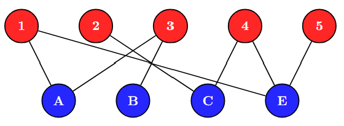

## Goals today

[]{.space-out}

1. Supply Chain Network Design Decisions
2. Single-Echelon Single-Commodity (SESC) Models
   * Concepts, Assumptions, and Network Structure
   * Bipartite Graph Representation
3. Constant-Cost Facility Location Model
   * Mathematical Formulation
   * Warehouse Location Example
4. Single-Sourcing Extension
5. Piecewise Cost Models

---

## 1. Supply Chain Network Design Decisions

[]{.space-out}

::: {.fragment}
Network planning involves designing systems for moving goods from suppliers to demand points or selecting service facilities in the public sector. Key decisions include the **number, location, size,** and **equipment of facilities**, as well as whether to **divest, relocate**, or **downsize** them.
:::

[]{.space-out}

#### Classification of Location Problems {.unnumbered .center .fragment}

::: {.fragment}
Location problems can be classified with respect to a number of criterias.
:::

:::: {.columns style="font-size: 80%;"}

::: {.column .block .red width=21% .fragment .center}
**Time Horizon**

- Single-period (make decision at the beginning)

- Multi-period (make decision in sequence)

:::

::: {.column .block .blue width=21% .fragment .center}
**Facility Typology**

- Single-type (e.g. only RDCs)

- Multi-type (both CDCs & RDCs)

:::

::: {.column .block .green width=21% .fragment .center}
**Material Flows**

- Single-commodity (homogeneous)

- Multi-commodity (several items)

:::

::: {.column .block .orange width=21% .fragment .center}
**Dominant Material Flows**

- Single-echelon (inbound/outbound)

- Multiple-echelon (inbound & outbound)

:::

::::

::: aside
RDCs = regional distribution centres;
CDCs = central distribution centres
:::

---

## 2. Single-Echelon Single-Commodity (SESC) Models

[]{.space-out}

A SESC Location Model is a logistics optimisation model used to select **optimal facility locations** (e.g., warehouses or distribution centers) in a **single-tiered distribution network**, handling only a **single type of product (commodity)**. This model simultaneously decides on facility locations and commodity distribution routes to **minimise overall logistics and operating costs.**

[]{.space-out}

**Example:** A petroleum company needs to locate fuel depots to serve gas stations across a region

|||
|---|---------------|
| **Echelon:** | Depot to station (one-tier system) |
| **Commodity:** | A single type of fuel (e.g. gasoline) |
| **Objective:** | Minimise total transportation and facility costs |

::: {.center}
{width=60% }
:::

---

## 2.1 Assumptions and Network Structure

The SESC network typically consists of two node types:

::: {.center .fragment}
{width=80% }
:::

#### Assumptions {.fragment}

:::: {.columns style = "font-size: 80%;"}

::: {.column}
- Only one product is shipped
- Customer demand must be fully satisfied
- Each customer is served by exactly one facility
:::
::: {.column}
- Facility capacity is often assumed unlimited (basic form)
- Transportation cost is proportional to distance or demand volume
:::
::::

---

#### Applications {.unnumbered}

:::{.fragment}

- Warehouse location planning

- Distribution center network design

- Retail supply chain optimization

- Public service facility placement (hospitals, fire stations)

- Emergency logistics networks
:::

#### Importance in Supply Chain Design {.fragment .unnumbered}

:::{.fragment}
This model is important because it serves as the foundation for more advanced models, such as
:::

- Capacitated facility location models

- Multi-commodity models

- Two-echelon and multi-echelon supply chain models

- Stochastic and robust network design models

---

### 2.2 Bipartite Graph {.unnumbered}

[]{.space-out}

::: {.callout-note appearance="minimal" style="font-size: 40px;"}
A **bipartite graph** is a network whose nodes can be divided into two separate groups, and connections are allowed only between groups, never within the same group.
:::

::: {.fragment}
In SESC:
:::

- **Group 1** = Facilities (warehouses, depots, plants)
- **Group 2** = Customers (demand points)

::: {.fragment}
Therefore,
:::

- ✅ Warehouse → Customer

- ❌ Warehouse → Warehouse

- ❌ Customer → Customer

::: {.fragment}
This matches the SESC assumption that we are only modelling shipments from facilities to customers.
:::

---

::: {.note}
Formally, a graph  

$$
G = (V,E)
$$

is **bipartite** if the vertex set $V$ can be divided into two subsets  $V_1$ and $V_2$ (i.e., $V_1 \cup V_2 = V$) such that:

- Every edge $(u,v) \in E$ has **one endpoint** in $V_1$ and the other in $V_2$.
- There are **no edges within** $V_1$ or within $V_2$.

:::

 

#### Example Structure of a Bipartite Graph {.unnumbered .fragment}

::: {.fragment}
$$
V = V_1 \cup V_2, \qquad V_1 \cap V_2 = \emptyset
$$

A bipartite graph is often represented as two groups of nodes with edges only across the groups.
:::

---

**Example:** Suppose we have 

- Warehouses A, B, C, and E.
- Customers 1, 2, 3, 4, and 5.

::: {.fragment}
The possible shipping routes from warehouses to customers can be represented as a bipartite graph:
:::

::: {.center .fragment}
{width=55%}
:::

::: {.fragment}
Every line represents a possible shipping route.
:::

---

#### Why Is It Important? {.unnumbered}

::: {.center}
{width=55%}
:::

The graph tells us:

- **Nodes**
  * Facility nodes $V_1 = {A, B, C, E}$, and customer nodes $V_2 = {1, 2, 3, 4, 5}$
- **Arcs** (possible shipping routes) $$(A, 1), (A, 3), (B, 3), (C, 2), (C, 4), (E, 1), (E,4), (E,5)$$
  * Each arc has associated costs
    - **Transportation cost** $c_{jk}$ and **shipment quantity** $y_{jk}$

--- 

## 3. Constant-Cost Facility Location Model {.unnumbered}

The bipartite graph structure allows us to define decision variables and constraints for the SESC model.

[]{.space-out}

- **Decision Variables**: 

  * $z_j$ = binary variable indicating whether facility $j$ is open (1) or closed (0).
  * $y_{jk}$ = quantity shipped from facility $j$ to customer $k$.

[]{.space-out}
  
- **Parameters**:

  * $c_{jk}$ = transportation cost per unit from facility $j$ to customer $k$.
  * $f_j$ = fixed cost of opening facility $j$.
  * $d_k$ = demand at customer $k$.
  * $K_j$ = capacity of facility $j$ (if applicable).

---

#### 3.1 Constant-Cost Facility Location Model Formulation {.unnumbered}

  

::: {.note}
- **Objective Function**: Minimise total cost, which includes transportation and facility costs.
$$
\text{Minimise} \quad Z = \sum_{j \in V_1} \sum_{k \in V_2} c_{jk} y_{jk} + \sum_{j \in V_1} f_j z_j
$$

- **Constraints**:
  * Demand satisfaction: $\sum_{j \in V_1} y_{jk} = d_k$ for all $k \in V_2$
  * Facility opening: $y_{jk} \leq K_j z_j$ for all $j \in V_1, k \in V_2$
  * Binary variables: $z_j \in \{0,1\}$ for all $j \in V_1$
  * Non-negativity: $y_{jk} \geq 0$ for all $j \in V_1, k \in V_2$

:::

---

#### 3.2 Constant-Cost Model Example: Warehouse Location Problem {.unnumbered}

A retailer must determine optimal warehouse locations to distribute a single commodity (e.g., bottled water) to three customer zones. Two warehouse locations are available (W1 and W2).

:::: {.columns}

::: {.column width=50%}
| Warehouse | Capacity (units) | Fixed Cost ($) |
| --------- | ---------------- | -------------: |
| W1        | 300              |          1,000 |
| W2        | 250              |            800 |

: Table 1. Warehouse data

:::

::: {.column width=50%}
| Customer Zone | Demand (units) |
| ------------- | -------------: |
| Zone A        |            150 |
| Zone B        |            120 |
| Zone C        |             80 |

: Table 2. Customer demand data

:::

::::

| Warehouse | Zone A | Zone B | Zone C |
| --------- | -----: | -----: | -----: |
| W1        |      4 |      3 |      5 |
| W2        |      2 |      4 |      3 |

: Table 3. Transportation cost per unit

---

#### Sets, Decision Variables, and Parameters

#### Sets and Indices {.fragment}

- $V_1 = \{1,2\}$: set of warehouses, indexed by $j$
- $V_2 = \{A,B,C\}$: set of customer zones, indexed by $k$

#### Decision Variables {.fragment}

- $z_j$: 1 if warehouse $j$ is opened; 0 otherwise
- $y_{jk}$: quantity shipped from warehouse $j$ to customer $k$

#### Parameters {.fragment}

- $D_k$: demand at customer zone $k$
- $K_j$: capacity of warehouse $j$
- $f_j$: fixed cost of opening warehouse $j$
- $c_{jk}$: transportation cost per unit from warehouse $j$ to customer zone $k$

---

#### Objective Function

::: {.fragment style="font-size: 90%;"}
$$
\min Z =
\sum_{j \in V_1}\sum_{k \in V_2} c_{jk}y_{jk}
+
\sum_{j \in V_1} f_j z_j
$$

$$
\min Z =
(4y_{1A}+3y_{1B}+5y_{1C})
+
(2y_{2A}+4y_{2B}+3y_{2C})
+
1000z_1+800z_2
$$
:::

#### Constraints {.fragment}

::: {.fragment style="font-size: 90%;"}
Demand satisfaction:
$$
\begin{aligned}
y_{1A}+y_{2A}&=150 \\
y_{1B}+y_{2B}&=120 \\
y_{1C}+y_{2C}&=80
\end{aligned}
$$
:::

::: {.fragment style="font-size: 90%;"}
Warehouse capacities:
$$
\begin{aligned}
y_{1A}+y_{1B}+y_{1C}&\le300z_1 \\
y_{2A}+y_{2B}+y_{2C}&\le250z_2
\end{aligned}
$$
:::

::: {.fragment style="font-size: 90%;"}
Binary and non-negativity: $z_j\in\{0,1\}, \quad
y_{jk}\ge0$

:::

---

#### Feasibility Analysis of Warehouse Configurations

First, evaluate all possible facility-opening configurations $(z_1, z_2)$.

::: {.center .fragment}
Since at least one warehouse must be open, 

there are three possible configurations: $(0,1), \; (1,0), \; (1,1)$
:::

::: {.fragment}

A configuration is feasible only if the total available capacity meets or exceeds the total demand:
:::

::: {.fragment style="font-size: 90%;"}
$$
\text{Total Demand} = \sum_{k \in V_2} D_k
=
150 + 120 + 80
=
350
$$
:::

::: {.fragment style="font-size: 90%;"}
$$
\text{Total Capacity} = \sum_{j \in V_1} K_j z_j
=
300z_1 + 250z_2
$$

:::

::: columns

::: {.column .center .fragment width="33%"}

### Case 1

**Warehouse 2 Open**

Capacity: 250 < 350

❌ **Infeasible**

:::

::: {.column .center .fragment width="33%"}

### Case 2

**Warehouse 1 Open**

Capacity:
300 < 350

❌ **Infeasible**

:::

::: {.column .center .fragment width="34%"}

### Case 3

**Both Warehouses Open**

Capacity:
550 > 350

✅ **Feasible**

:::

:::

::: notes
Note. SESC model is commonly solved using Mixed-Integer Linear Programming (MILP), because binary decision variables are not suitable for Lagrangian method. Also, manual calculation will become infeasible as the number of variables and the complexity of the constraints and cost structure increase. 
:::

---

#### Optimal Shipment Allocation for the Feasible Configuration

Consider the feasible case where **both warehouses are open**: $z_1 = 1,\; z_2 = 1$

:::: {.columns}

::: {.column .center width=50% style="font-size: 90%;"}
| Warehouse | Zone A | Zone B | Zone C |
|-----------|-------:|-------:|-------:|
| W1 | 4 | 3 | 5 |
| W2 | 2 | 4 | 3 |
: Table 3. Transportation Costs
:::
::: {.column .center width=50% style="font-size: 90%;"}

| Customer Zone | Demand |
|---------------|-------:|
| Zone A | 150 |
| Zone B | 120 |
| Zone C | 80 |
: Table 2. Customer Demands
:::
::::

- **Zone A:** lowest cost is from **W2** (\$2/unit)$\Rightarrow y_{2A}=150$

- **Zone B:** lowest cost is from **W1** (\$3/unit)$\Rightarrow y_{1B}=120$

- **Zone C:** lowest cost is from **W2** (\$3/unit)$\Rightarrow y_{2C}=80$

- **Capacity Verification**

  * Warehouse 1 utilisation: $120 \le 300$ ✅ Capacity satisfied

  * Warehouse 2 utilisation: $150 + 80 = 230 \le 250$ ✅ Capacity satisfied

- **Objective Function** $2(150)+3(120)+3(80)+1000+800= 2700$

::: notes
If the problem itself is fairly simple (≤ 3 facilities and ≤ 3 customers), we can evaluate the objective function for each possible combinations and pick the lowest Z. Otherwise, computer programming is required.
:::

---