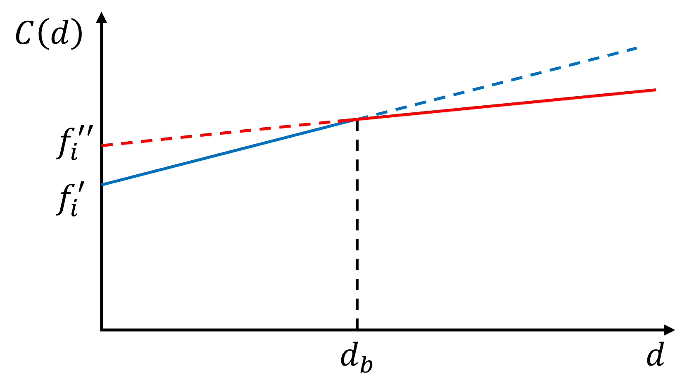

## Goals today

[]{.space-out}

1. Supply Chain Network Design Decisions
2. Single-Echelon Single-Commodity (SESC) Models
   * Concepts, Assumptions, and Network Structure
   * Bipartite Graph Representation
3. Constant-Cost Facility Location Model
   * Mathematical Formulation
   * Warehouse Location Example
4. Single-Sourcing Extension
5. Piecewise Cost Models


---

## 1. Supply Chain Network Design Decisions

[]{.space-out}


::: {.fragment}
Network planning involves designing systems for moving goods from suppliers to demand points or selecting service facilities in the public sector. Key decisions include the **number, location, size,** and **equipment of facilities**, as well as whether to **divest, relocate**, or **downsize** them.
:::

[]{.space-out}

#### Classification of Location Problems {.unnumbered .center .fragment}

::: {.fragment}
Location problems can be classified with respect to a number of criterias.
:::

:::: {.columns style="font-size: 80%;"}

::: {.column .block .red width=21% .fragment .center}
**Time Horizon**

- Single-period (make decision at the beginning)

- Multi-period (make decision in sequence)

:::

::: {.column .block .blue width=21% .fragment .center}
**Facility Typology**

- Single-type (e.g. only RDCs)

- Multi-type (both CDCs & RDCs)

:::

::: {.column .block .green width=21% .fragment .center}
**Material Flows**

- Single-commodity (homogeneous)

- Multi-commodity (several items)

:::

::: {.column .block .orange width=21% .fragment .center}
**Dominant Material Flows**

- Single-echelon (inbound/outbound)

- Multiple-echelon (inbound & outbound)

:::

::::

::: aside
RDCs = regional distribution centres;
CDCs = central distribution centres
:::


---

## 2. Single-Echelon Single-Commodity (SESC) Models

[]{.space-out}

A SESC Location Model is a logistics optimisation model used to select **optimal facility locations** (e.g., warehouses or distribution centers) in a **single-tiered distribution network**, handling only a **single type of product (commodity)**. This model simultaneously decides on facility locations and commodity distribution routes to **minimise overall logistics and operating costs.**

[]{.space-out}

**Example:** A petroleum company needs to locate fuel depots to serve gas stations across a region

|||
|---|---------------|
| **Echelon:** | Depot to station (one-tier system) |
| **Commodity:** | A single type of fuel (e.g. gasoline) |
| **Objective:** | Minimise total transportation and facility costs |

::: {.center}
{width=60% }
:::

---

## 2.1 Assumptions and Network Structure

The SESC network typically consists of two node types:

::: {.center .fragment}
{width=80% }
:::

#### Assumptions {.fragment}

:::: {.columns style = "font-size: 80%;"}

::: {.column}
- Only one product is shipped
- Customer demand must be fully satisfied
- Each customer is served by exactly one facility
:::
::: {.column}
- Facility capacity is often assumed unlimited (basic form)
- Transportation cost is proportional to distance or demand volume
:::
::::

---

#### Applications {.unnumbered}

:::{.fragment}

- Warehouse location planning

- Distribution center network design

- Retail supply chain optimization

- Public service facility placement (hospitals, fire stations)

- Emergency logistics networks
:::

#### Importance in Supply Chain Design {.fragment .unnumbered}

:::{.fragment}
This model is important because it serves as the foundation for more advanced models, such as
:::

- Capacitated facility location models

- Multi-commodity models

- Two-echelon and multi-echelon supply chain models

- Stochastic and robust network design models

---

### 2.2 Bipartite Graph {.unnumbered}

[]{.space-out}

::: {.callout-note appearance="minimal" style="font-size: 40px;"}
A **bipartite graph** is a network whose nodes can be divided into two separate groups, and connections are allowed only between groups, never within the same group.
:::

::: {.fragment}
In SESC:
:::

- **Group 1** = Facilities (warehouses, depots, plants)
- **Group 2** = Customers (demand points)

::: {.fragment}
Therefore,
:::

- ✅ Warehouse → Customer

- ❌ Warehouse → Warehouse

- ❌ Customer → Customer

::: {.fragment}
This matches the SESC assumption that we are only modelling shipments from facilities to customers.
:::


---

::: {.note}
Formally, a graph  

$$
G = (V,E)
$$

is **bipartite** if the vertex set $V$ can be divided into two subsets  $V_1$ and $V_2$ (i.e., $V_1 \cup V_2 = V$) such that:


- Every edge $(u,v) \in E$ has **one endpoint** in $V_1$ and the other in $V_2$.
- There are **no edges within** $V_1$ or within $V_2$.

:::

<br>

#### Example Structure of a Bipartite Graph {.unnumbered .fragment}

::: {.fragment}
$$
V = V_1 \cup V_2, \qquad V_1 \cap V_2 = \emptyset
$$

A bipartite graph is often represented as two groups of nodes with edges only across the groups.
:::

---

**Example:** Suppose we have 

- Warehouses A, B, C, and E.
- Customers 1, 2, 3, 4, and 5.

::: {.fragment}
The possible shipping routes from warehouses to customers can be represented as a bipartite graph:
:::

::: {.center .fragment}
{width=55%}
:::

::: {.fragment}
Every line represents a possible shipping route.
:::

---

#### Why Is It Important? {.unnumbered}

::: {.center}
{width=55%}
:::

The graph tells us:

- **Nodes**
  * Facility nodes $V_1 = {A, B, C, E}$, and customer nodes $V_2 = {1, 2, 3, 4, 5}$
- **Arcs** (possible shipping routes) $$(A, 1), (A, 3), (B, 3), (C, 2), (C, 4), (E, 1), (E,4), (E,5)$$
  * Each arc has associated costs
    - **Transportation cost** $c_{jk}$ and **shipment quantity** $y_{jk}$


--- 

## 3. Constant-Cost Facility Location Model {.unnumbered}

The bipartite graph structure allows us to define decision variables and constraints for the SESC model.

[]{.space-out}

- **Decision Variables**: 

  * $z_j$ = binary variable indicating whether facility $j$ is open (1) or closed (0).
  * $y_{jk}$ = quantity shipped from facility $j$ to customer $k$.

[]{.space-out}
  
- **Parameters**:

  * $c_{jk}$ = transportation cost per unit from facility $j$ to customer $k$.
  * $f_j$ = fixed cost of opening facility $j$.
  * $d_k$ = demand at customer $k$.
  * $K_j$ = capacity of facility $j$ (if applicable).


---

### 3.1 Constant-Cost Facility Location Model Formulation {.unnumbered}

<br> 

::: {.note}
- **Objective Function**: Minimise total cost, which includes transportation and facility costs.
$$
\text{Minimise} \quad Z = \sum_{j \in V_1} \sum_{k \in V_2} c_{jk} y_{jk} + \sum_{j \in V_1} f_j z_j
$$

- **Constraints**:
  * Demand satisfaction: $\sum_{j \in V_1} y_{jk} = d_k$ for all $k \in V_2$
  * Facility opening: $y_{jk} \leq K_j z_j$ for all $j \in V_1, k \in V_2$
  * Binary variables: $z_j \in \{0,1\}$ for all $j \in V_1$
  * Non-negativity: $y_{jk} \geq 0$ for all $j \in V_1, k \in V_2$

:::

---

### 3.2 Constant-Cost Model Example: Warehouse Location Problem {.unnumbered}

A retailer must determine optimal warehouse locations to distribute a single commodity (e.g., bottled water) to three customer zones. Two warehouse locations are available (W1 and W2).

:::: {.columns}

::: {.column width=50%}
| Warehouse | Capacity (units) | Fixed Cost ($) |
| --------- | ---------------- | -------------: |
| W1        | 300              |          1,000 |
| W2        | 250              |            800 |

: Table 1. Warehouse data


:::

::: {.column width=50%}
| Customer Zone | Demand (units) |
| ------------- | -------------: |
| Zone A        |            150 |
| Zone B        |            120 |
| Zone C        |             80 |

: Table 2. Customer demand data

:::

::::

| Warehouse | Zone A | Zone B | Zone C |
| --------- | -----: | -----: | -----: |
| W1        |      4 |      3 |      5 |
| W2        |      2 |      4 |      3 |

: Table 3. Transportation cost per unit

---

#### Sets, Decision Variables, and Parameters

#### Sets and Indices {.fragment}

- $V_1 = \{1,2\}$: set of warehouses, indexed by $j$
- $V_2 = \{A,B,C\}$: set of customer zones, indexed by $k$

#### Decision Variables {.fragment}

- $z_j$: 1 if warehouse $j$ is opened; 0 otherwise
- $y_{jk}$: quantity shipped from warehouse $j$ to customer $k$

#### Parameters {.fragment}

- $D_k$: demand at customer zone $k$
- $K_j$: capacity of warehouse $j$
- $f_j$: fixed cost of opening warehouse $j$
- $c_{jk}$: transportation cost per unit from warehouse $j$ to customer zone $k$

---

#### Objective Function

::: {.fragment style="font-size: 90%;"}
$$
\min Z =
\sum_{j \in V_1}\sum_{k \in V_2} c_{jk}y_{jk}
+
\sum_{j \in V_1} f_j z_j
$$

$$
\min Z =
(4y_{1A}+3y_{1B}+5y_{1C})
+
(2y_{2A}+4y_{2B}+3y_{2C})
+
1000z_1+800z_2
$$
:::

#### Constraints {.fragment}

::: {.fragment style="font-size: 90%;"}
Demand satisfaction:
$$
\begin{aligned}
y_{1A}+y_{2A}&=150 \\
y_{1B}+y_{2B}&=120 \\
y_{1C}+y_{2C}&=80
\end{aligned}
$$
:::

::: {.fragment style="font-size: 90%;"}
Warehouse capacities:
$$
\begin{aligned}
y_{1A}+y_{1B}+y_{1C}&\le300z_1 \\
y_{2A}+y_{2B}+y_{2C}&\le250z_2
\end{aligned}
$$
:::

::: {.fragment style="font-size: 90%;"}
Binary and non-negativity: $z_j\in\{0,1\}, \quad
y_{jk}\ge0$

:::

---

#### Feasibility Analysis of Warehouse Configurations

First, evaluate all possible facility-opening configurations $(z_1, z_2)$.

::: {.center .fragment}
Since at least one warehouse must be open, 

there are three possible configurations: $(0,1), \; (1,0), \; (1,1)$
:::

::: {.fragment}

A configuration is feasible only if the total available capacity meets or exceeds the total demand:
:::

::: {.fragment style="font-size: 90%;"}
$$
\text{Total Demand} = \sum_{k \in V_2} D_k
=
150 + 120 + 80
=
350
$$
:::

::: {.fragment style="font-size: 90%;"}
$$
\text{Total Capacity} = \sum_{j \in V_1} K_j z_j
=
300z_1 + 250z_2
$$

:::

::: columns

::: {.column .center .fragment width="33%"}

#### Case 1

**Warehouse 2 Open**

Capacity: 250 < 350

❌ **Infeasible**

:::

::: {.column .center .fragment width="33%"}

#### Case 2

**Warehouse 1 Open**

Capacity:
300 < 350

❌ **Infeasible**

:::

::: {.column .center .fragment width="34%"}

#### Case 3

**Both Warehouses Open**

Capacity:
550 > 350

✅ **Feasible**

:::

:::

---

#### Optimal Shipment Allocation for the Feasible Configuration

Consider the feasible case where **both warehouses are open**: $z_1 = 1,\; z_2 = 1$

:::: {.columns}

::: {.column .center width=50% style="font-size: 90%;"}
| Warehouse | Zone A | Zone B | Zone C |
|-----------|-------:|-------:|-------:|
| W1 | 4 | 3 | 5 |
| W2 | 2 | 4 | 3 |
: Table 3. Transportation Costs
:::
::: {.column .center width=50% style="font-size: 90%;"}

| Customer Zone | Demand |
|---------------|-------:|
| Zone A | 150 |
| Zone B | 120 |
| Zone C | 80 |
: Table 2. Customer Demands
:::
::::

- **Zone A:** lowest cost is from **W2** (\$2/unit)$\Rightarrow y_{2A}=150$

- **Zone B:** lowest cost is from **W1** (\$3/unit)$\Rightarrow y_{1B}=120$

- **Zone C:** lowest cost is from **W2** (\$3/unit)$\Rightarrow y_{2C}=80$

- **Capacity Verification**

  * Warehouse 1 utilisation: $120 \le 300$ ✅ Capacity satisfied

  * Warehouse 2 utilisation: $150 + 80 = 230 \le 250$ ✅ Capacity satisfied


- **Objective Function** $2(150)+3(120)+3(80)+1000+800= 2700$

::: notes
If the problem itself is fairly simple (≤ 3 facilities and ≤ 3 customers), we can evaluate the objective function for each possible combinations and pick the lowest Z. Otherwise, computer programming is required.
:::

---

### 3.3 Python Implementation

::: {.callout-warning appearance="minimal" style="font-size: 36px;"}
SESC model is commonly solved using **Mixed-Integer Linear Programming (MILP)** (`sciply.optimize.milp`), because binary decision variables are not suitable for Lagrangian method. Also, manual calculation will become infeasible as the number of variables and the complexity of the constraints and cost structure increase.
:::

```{python}
#| code-fold: true
#| code-summary: "Click to show Python code for SESC model"
import numpy as np
from scipy.optimize import milp, LinearConstraint, Bounds

# Variables:
# y1A, y1B, y1C, y2A, y2B, y2C, z1, z2

c = np.array([
    4, 3, 5,    # y1A, y1B, y1C
    2, 4, 3,    # y2A, y2B, y2C
    1000, 800   # z1, z2
])

# Demand constraints:
# y1A + y2A = 150
# y1B + y2B = 120
# y1C + y2C = 80

A_demand = np.array([
    [1, 0, 0, 1, 0, 0, 0, 0],
    [0, 1, 0, 0, 1, 0, 0, 0],
    [0, 0, 1, 0, 0, 1, 0, 0]
])

demand_lb = np.array([150, 120, 80])
demand_ub = np.array([150, 120, 80])

# Capacity constraints:
# y1A + y1B + y1C <= 300z1
# y2A + y2B + y2C <= 250z2

A_capacity = np.array([
    [1, 1, 1, 0, 0, 0, -300, 0],
    [0, 0, 0, 1, 1, 1, 0, -250]
])

capacity_lb = np.array([-np.inf, -np.inf])
capacity_ub = np.array([0, 0])

# Combine constraints
A = np.vstack([A_demand, A_capacity])

lb = np.concatenate([demand_lb, capacity_lb])
ub = np.concatenate([demand_ub, capacity_ub])

constraints = LinearConstraint(A, lb, ub)

# Bounds:
# y >= 0
# 0 <= z <= 1
bounds = Bounds(
    lb=[0, 0, 0, 0, 0, 0, 0, 0],
    ub=[np.inf, np.inf, np.inf, np.inf, np.inf, np.inf, 1, 1]
)

# Integrality:
# 0 = continuous
# 1 = integer
integrality = np.array([0, 0, 0, 0, 0, 0, 1, 1])

result = milp(
    c=c,
    constraints=constraints,
    bounds=bounds,
    integrality=integrality
)

print("Optimisation Success:", result.success)
print("Objective Function Value:", result.fun)
print("Decision Variables:", result.x)
```

::: {style="font-size: 90%;"}
Python returns the decision variables in the order: $[y_{1A}, y_{1B}, y_{1C}, y_{2A}, y_{2B}, y_{2C}, z_1, z_2]$


**Optimal Solution:**

$$\boxed{
y_{1A}=70,\; y_{1B}=120,\; y_{1C}=0,\; y_{2A}=80,\; y_{2B}=0,\; y_{2C}=80, \;z_1=1,\; z_2=1}
$$

**Minimum cost:**

$$
\boxed{Z=2700}
$$
:::


---

## 4. Single-Sourcing Extension {.unnumbered}

A constraint that enforces each customer (or demand point) to be **served by exactly one facility** (e.g., warehouse, depot, plant)

[]{.space-out}

::: {.fragment}
In standard SESC models, the shipment variable $y_{jk}$ represents the amount of product shipped from facility $j$ to customer $k$. Under single-sourcing, each customer $k$ must receive its entire demand from only one facility.
:::

<br>

#### Mathematically {.fragment}

::: {.fragment}
Let $x_{jk} \in \{0,1\}$: binary assignment - if facility $j$ serves customer $k$ or not.
:::

1. Demand assigned to one source only: $\sum_j x_{jk} = 1, \quad \forall k \in V_2$

2. Flow consistency (linking constraint): $y_{jk} = D_k x_{jk}, \quad \forall j \in V_1, k \in V_2$

  * Shipments match full demand only if facility $j$ is assigned to serve customer $k$.

---

### 4.1 Single-Sourcing Example

An emergency response organisation selects from four potential distribution facilities (F1, F2, F3, F4) to supply drinking water to six affected areas (A, B, C, D, E, F) following a natural disaster. Each area’s demand must be satisfied entirely from exactly one distribution facility.

:::: {.columns style="font-size: 90%;"}
::: {.column width=50%}

| Facility | Capacity (litres) | Fixed Cost ($) |
| -------- | ----------------- | -------------: |
| F1       | 400              |          2000 |
| F2       | 350              |          1800 | 
| F3       | 450              |          2200 |
| F4      | 500              |          2500 |

: Table 1. Facility data

:::
::: {.column width=50%}
| Facility | A | B | C | D | E | F |
| -------- | -: | -: | -: | -: | -: | -: |
| F1       | 3 | 4 | 5 | 4 | 3 | 4 |
| F2       | 4 | 3 | 2 | 5 | 4 | 3 |
| F3       | 3 | 2 | 5 | 4 | 3 | 5 |
| F4       | 5 | 3 | 4 | 2 | 3 | 4 |

: Table 3. Transportation cost/unit

:::

::::

| Affected Area | A | B | C | D | E | F |
|---------------|---|---|---|---|---|---|
| Demand (units) | 150 | 100 | 180 | 150 | 120 | 100 |

: Table 2. Affected area demand data

---

##### Sets and indices {.fragment}

- Set of facilities:			$𝐽={1, 2, 3, 4}$,			indexed by $𝑗$
- Set of customer zones:	$𝐾={𝐴, 𝐵, 𝐶, 𝐷, 𝐸, 𝐹}$,		indexed by $𝑘$

##### Decision variables {.fragment}

- $z_j \in \{0,1\}$: Facility opening decisions variables: 
- **$x_{jk} \in \{0,1\}$: Assignment decision (single-sourcing), if facility $j$ serves customer $k$ or not.**
- $y_{jk}$: Quantity shipped from warehouse $j$ to customer $k$.

##### Parameters {.fragment}

- $D_k$: Demand of customer $k$
- $c_{jk}$: Transportation cost per unit from facility $j$ to area $k$
- $K_j$: Capacity of facility $j$
- $f_j$: Fixed cost of opening warehouse $j$

---

##### Objective function and constraints

::: {style="font-size: 85%;"}
$$
\min{Z}=\min{\sum_{j\in J}{\sum_{k\in K}{c_{jk}y_{jk}}+\sum_{j\in J}{f_jz_j}}}
$$

$$
\begin{aligned}
\text{s.t.} \;\sum_{j\in J}{x_{jk}=1,} \quad \forall k\in K \quad&\textbf{Demand satisfaction (single-sourcing)} \\
y_{jk}=D_k x_{jk}, \quad \forall j\in J, k\in K \quad&\textbf{Flow consistency} \\[0.5em]
\sum_{k\in K}{y_{jk}}\le K_j z_j, \quad \forall j\in J \quad&\text{Capacity constraints} \\
 x_{jk}\le z_j, \quad \forall j\in J, k\in K \quad&\textbf{Assignment only if facility is open} \\[0.7em]
z_j\in\{0,1\}, \quad \forall j\in J \quad&\text{Binary facility opening} \\[0.7em]
x_{jk}\in\{0,1\}, \quad \forall j\in J, k\in K \quad&\textbf{Binary assignment} \\[0.7em]
y_{jk}\ge0, \quad \forall j\in J, k\in K \quad&\text{Non-negativity}
\end{aligned}
$$

:::

---

### 4.2 Python Implementation

```{python}
#| code-fold: true
#| code-summary: "Click to show Python code"
import numpy as np
from scipy.optimize import milp, LinearConstraint, Bounds

# Decision variables:
#
# x1A, x1B, x1C, x1D, x1E, x1F
# x2A, x2B, x2C, x2D, x2E, x2F
# x3A, x3B, x3C, x3D, x3E, x3F
# x4A, x4B, x4C, x4D, x4E, x4F
# z1, z2, z3, z4
#
# xij = 1 if area j is assigned to facility i
# zi = 1 if facility i is opened

c = np.array([
    3*150, 4*100, 5*180, 4*150, 3*120, 4*100,
    4*150, 3*100, 2*180, 5*150, 4*120, 3*100,
    3*150, 2*100, 5*180, 4*150, 3*120, 5*100,
    5*150, 3*100, 4*180, 2*150, 3*120, 4*100,
    2000, 1800, 2200, 2500
])

# Demand assignment constraints:
# Each affected area must be assigned to exactly one facility.

A_demand = np.array([
    [1, 0, 0, 0, 0, 0, 1, 0, 0, 0, 0, 0, 1, 0, 0, 0, 0, 0, 1, 0, 0, 0, 0, 0],  # Area A
    [0, 1, 0, 0, 0, 0, 0, 1, 0, 0, 0, 0, 0, 1, 0, 0, 0, 0, 0, 1, 0, 0, 0, 0],  # Area B
    [0, 0, 1, 0, 0, 0, 0, 0, 1, 0, 0, 0, 0, 0, 1, 0, 0, 0, 0, 0, 1, 0, 0, 0],  # Area C
    [0, 0, 0, 1, 0, 0, 0, 0, 0, 1, 0, 0, 0, 0, 0, 1, 0, 0, 0, 0, 0, 1, 0, 0],  # Area D
    [0, 0, 0, 0, 1, 0, 0, 0, 0, 0, 1, 0, 0, 0, 0, 0, 1, 0, 0, 0, 0, 0, 1, 0],  # Area E
    [0, 0, 0, 0, 0, 1, 0, 0, 0, 0, 0, 1, 0, 0, 0, 0, 0, 1, 0, 0, 0, 0, 0, 1],  # Area F
])

A_demand = np.hstack([A_demand, np.zeros((6, 4))])

demand_lb = np.ones(6)
demand_ub = np.ones(6)

# Capacity constraints:
# demand_A*x1A + ... + demand_F*x1F <= capacity_1*z1

A_capacity = np.array([
    [150, 100, 180, 150, 120, 100, 0, 0, 0, 0, 0, 0, 0, 0, 0, 0, 0, 0, 0, 0, 0, 0, 0, 0, -400, 0, 0, 0],
    [0, 0, 0, 0, 0, 0, 150, 100, 180, 150, 120, 100, 0, 0, 0, 0, 0, 0, 0, 0, 0, 0, 0, 0, 0, -350, 0, 0],
    [0, 0, 0, 0, 0, 0, 0, 0, 0, 0, 0, 0, 150, 100, 180, 150, 120, 100, 0, 0, 0, 0, 0, 0, 0, 0, -450, 0],
    [0, 0, 0, 0, 0, 0, 0, 0, 0, 0, 0, 0, 0, 0, 0, 0, 0, 0, 150, 100, 180, 150, 120, 100, 0, 0, 0, -500],
])

capacity_lb = np.array([-np.inf, -np.inf, -np.inf, -np.inf])
capacity_ub = np.array([0, 0, 0, 0])

# Combine constraints

A = np.vstack([A_demand, A_capacity])

lb = np.concatenate([demand_lb, capacity_lb])
ub = np.concatenate([demand_ub, capacity_ub])

constraints = LinearConstraint(A, lb, ub)

# Bounds:
# All xij and zi are binary, so bounds are 0 <= variable <= 1

bounds = Bounds(
    lb=np.zeros(28),
    ub=np.ones(28)
)

# Integrality:
# 1 means integer.
# Since all variables are bounded between 0 and 1, they are binary.

integrality = np.ones(28)

result = milp(
    c=c,
    constraints=constraints,
    bounds=bounds,
    integrality=integrality
)

print("Optimisation Success:", result.success)
print("Objective Function Value:", result.fun)
print("Decision Vars:", result.x)

# Display solution more clearly

x = result.x[:24].reshape(4, 6)
z = result.x[24:]

facility_names = ["F1", "F2", "F3", "F4"]
area_names = ["A", "B", "C", "D", "E", "F"]
demand = np.array([150, 100, 180, 150, 120, 100])
capacity = np.array([400, 350, 450, 500])

fac = [facility_names[i] for i in range(4) if round(z[i]) == 1]
print(f"\nOpened facilities: {fac}")

assignments = []
for j in range(6):
    i = np.argmax(x[:, j])
    assignments.append((area_names[j], facility_names[i]))

print(f"\nAssignments: {assignments}")

print("\nFacility usage:")
for i in range(4):
    used = np.sum(demand * x[i, :])
    print(f"{facility_names[i]}: {used:.0f} / {capacity[i]}")
```

---

## 5. Piecewise Cost Models {.unnumbered}

The operating cost of a potential facility is usually a piecewise linear function. In the simplest case, there are only two piecewise lines. The operating costs of potential facility $𝑖$, $𝐶(𝑑)$, for a particular demand $𝑑$ are characterised by fixed costs ($𝑓_𝑖'$ and $𝑓_𝑖''$) and marginal costs ($𝑔_𝑖'$ and $𝑔_i''$).  Then,

::: {style="font-size: 85%;"}
$$
C(d) =
\begin{cases}
\color{blue}{f_i^\prime+g_i^\prime\cdot d} &  0<d\le d_b, \\
\color{crimson}{f_i^{\prime\prime}+g_i^{\prime\prime}\cdot d} &  d>d_b, \\
0 &  d=0
\end{cases}
$$

:::

::: {.center}
{width=50%}
:::

---

### 5.1 Piecewise Cost Model Example

Historical demand and costs data of a firm are given as follows

::: {style="font-size: 70%;"}
| d | 1000 | 2500 | 3500 | 6000 | 8000 | 9000 | 9500 | 12000 | 13500 | 15000 | 16000 | 18000 |
|---|------|------|------|------|------|------|------|-------|------|------|------|------|
| C(d) | 17579 | 56350 | 62208 | 76403 | 85491 | 90237 | 96251 | 109429 | 110755 | 122432 | 116816 | 124736 |
:::

Use the above data to model the relationship between demand and cost as a piecewise linear function with a known breakpoint at $𝑑=𝑑_𝑏=3500$. Explain the results and formulate the optimisation model.


```{python}
#| code-fold: true
#| fig-align: "center"
import numpy as np
import matplotlib.pyplot as plt
from scipy.optimize import curve_fit

d = np.array([1000, 2500, 3500, 6000, 8000, 9000, 
              9500, 12000, 13500, 15000, 16000, 18000])
C = np.array([17579, 56350, 62208, 76403, 85491, 90237,
              96251, 109429, 110755, 122432, 116816, 124736])

# Breakpoint
d_b = 3500

# Fit piecewise linear functions
def piecewise_linear(d, f1, g1, f2, g2):
    return np.where(d <= d_b, f1 + g1 * d, f2 + g2 * d)

popt, _ = curve_fit(piecewise_linear, d, C)
f1, g1, f2, g2 = popt
print("Piecewise linear parameters:")
print(f"f1 = {f1:.2f}, g1 = {g1:.2f}, f2 = {f2:.2f}, g2 = {g2:.2f}")

# Plot data and fitted piecewise linear function
d_fit = np.linspace(0, 20000, 100)
C_fit = piecewise_linear(d_fit, *popt)

plt.figure(figsize=(7, 2))
plt.scatter(d, C, label='Data', color='black')
plt.plot(d_fit, C_fit, label='Fitted Piecewise Linear', color='black', linewidth=1)
plt.plot(np.linspace(0,3500,100), f1 + g1 * np.linspace(0,3500,100), label='Segment 1', color='blue')
plt.plot(np.linspace(3500,20000,100), f2 + g2 * np.linspace(3500,20000,100), label='Segment 2', color='red')
plt.axvline(x=d_b, color='green', linestyle='--', label='Breakpoint d_b=3500')
plt.xlabel('Demand (d)')
plt.ylabel('Cost C(d)')
plt.grid()
plt.show()
```

---

```{python}
#| echo: false
#| fig-align: "center"
plt.figure(figsize=(7, 3))
plt.scatter(d, C, label='Data', color='black')
plt.plot(d_fit, C_fit, label='Fitted Piecewise Linear', color='black', linewidth=1)
plt.plot(np.linspace(0,3500,100), f1 + g1 * np.linspace(0,3500,100), label='Segment 1', color='blue')
plt.plot(np.linspace(3500,20000,100), f2 + g2 * np.linspace(3500,20000,100), label='Segment 2', color='red')
plt.axvline(x=d_b, color='green', linestyle='--', label='Breakpoint d_b=3500')
plt.xlabel('Demand (d)')
plt.ylabel('Cost C(d)')
plt.grid()
plt.show()
```

::: {style="font-size: 85%;"}
$$
C(d) =
\begin{cases}
\color{blue}{f_i^\prime+g_i^\prime\cdot d} &  0<d\le d_b, \\
\color{crimson}{f_i^{\prime\prime}+g_i^{\prime\prime}\cdot d} &  d>d_b, \\
0 &  d=0
\end{cases}
\Rightarrow
C(d) =
\begin{cases}
\color{blue}{2252.37 + 18.48d} &  0<d\le \color{green}{3500}, \\
\color{crimson}{54287.74 + 4.15d} &  d>\color{green}{3500}, \\
0 &  d=0
\end{cases}
$$
:::

---

#### 5.1 Piecewise Cost Model Example (cont.)

::: {style="font-size: 90%"}
A company is considering network design decisions over two planning periods and deciding between two warehouse locations (A and B) to serve three market regions (X, Y, and Z). Demand is uncertain and may vary between periods. The company must determine which warehouse(s) to open and how to allocate demand in each period to minimise total costs, including both fixed and transportation costs.

| Warehouse/Market | X | Y | Z | Fixed Cost (\$) | Capacity (tonnes) |
|:----:|---:|---:|---:|-------:|-------:|
| **A** | 200 | 300 | 100 | 50,000 | 60 |
| **B** | 250 | 150 | 200 | 40,000 | 50 |
| **Period 1 Demand** | 30 | 40 | 20 | | |

: Table 1. Capacity, demand, and transportation cost

[]{.space-out}

**Potential Demand Changes (Period 2)**

::: {.nonincremental}
- Scenario 1: Market X increases by 10%, Y decreases by 20%, Z remains constant.
- Scenario 2: Market X decreases by 15%, Y increases by 25%, Z increases by 10%.
:::

:::

---

#### Objective function and contraints (Period 1)

::: {style="font-size: 80%"}
$$
\min{Z}=\min{\sum_{j\in J}{\sum_{k\in K} C_{jk}+\sum_{j\in J}{f_jz_j}}},
$$
where $C_{jk}$ is a cost of serving market $k$ from warehouse $j:$
$C_{jk} = \begin{cases}f_i^\prime+g_i^\prime\cdot d &  y_{jk}\le d_b, \\f_i^{\prime\prime}+g_i^{\prime\prime}\cdot d & y_{jk}>d_b.\end{cases}$

$$
\begin{aligned}
\text{s.t.} \;\sum_{j\in J}{x_{jk}=1,} \quad \forall k\in K \quad&\text{Demand satisfaction (single-sourcing)} \\
y_{jk}=D_k x_{jk}, \quad \forall j\in J, k\in K \quad&\text{Flow consistency} \\[0.5em]
\sum_{k\in K}{y_{jk}}\le K_j z_j, \quad \forall j\in J \quad&\text{Capacity constraints} \\
 x_{jk}\le z_j, \quad \forall j\in J, k\in K \quad&\text{Assignment only if facility is open} \\[0.6em]
z_j,x_{jk}\in\{0,1\}, \quad \forall j\in J \quad&\text{Binary facility opening and assignment} \\[0.6em]
y_{jk}\ge0, \quad \forall j\in J, k\in K \quad&\text{Non-negativity}
\end{aligned}
$$

:::

---

### 5.2 Additional constraints (Big-M Formulation)

##### Binary piecewise cost function assignment
::: {style="font-size: 80%"}
$$
w_{jk}\in\{0,1\}, \quad \forall j\in J, k\in K \quad
\begin{cases}
0:\text{ lower segment }  y_{jk} \le d_b \text{ is active} \\
1:\text{ upper segment }  y_{jk} > d_b \text{ is active}
\end{cases}
$$
:::

##### Piecewise cost approximiation (Big-M Form)
::: {style="font-size: 80%"}
$$
\begin{aligned}
C_{jk}\geq f_{jk}^\prime+g_{jk}^\prime\cdot y_{jk}-Mw_{jk} \quad &\text{Lower segment constraint} \\[0.5em]
C_{jk}\geq f_{jk}^{\prime\prime}+g_{jk}^{\prime\prime}\cdot y_{jk}-M{(1-w}_{jk}) \quad &\text{Upper segment constraint} \\[0.5em]
y_{jk}\le d_b+Mw_{jk} \quad &\text{Breakpoint enforcement from below} \\[0.5em]
y_{jk}\geq d_b+\epsilon-M(1-w_{jk}) \quad &\text{Breakpoint enforcement from above}
\end{aligned}
$$
:::

::: {.callout-important appearance="minimal" style="font-size: 35px;"}
#### Big-M Formulation

Big-M is a common technique in mixed-integer programming to model **logical conditions**. The choice of M should be sufficiently large to effectively "turn off" the constraints when the corresponding binary variable is 0, but not so large as to cause numerical instability.
:::

---

#### Piecewise cost approximation (Big-M Form) explain 

::: {style="font-size: 80%"}

Let $M$ be a sufficiently large constant (e.g., larger than the maximum possible cost difference between segments).

::: {.fragment}
**Scenario 1:** Lower segment is active ($w_{jk}=0$)
:::

::: {.fragment}
$$
\begin{aligned}
C_{jk}\geq f_{jk}^\prime+g_{jk}^\prime\cdot y_{jk}-Mw_{jk} \; & \Rightarrow C_{jk}\geq f_{jk}^\prime+g_{jk}^\prime\cdot y_{jk} \; \text{(Active for lower segment)} \\[0.5em]
C_{jk}\geq f_{jk}^{\prime\prime}+g_{jk}^{\prime\prime}\cdot y_{jk}-M{(1-w}_{jk}) \; & \Rightarrow C_{jk} \ge \text{Large negative (Inactive, always satisfied)} \\[0.5em]
y_{jk}\le d_b+Mw_{jk} \quad & \Rightarrow y_{jk} \le d_b \;\text{(Active, enforce lower segment)} \\[0.5em]
y_{jk}\geq d_b+\epsilon-M(1-w_{jk}) \quad &\Rightarrow y_{jk} \ge  \text{Large negative (Inactive, always satisfied)}
\end{aligned}
$$
:::

::: {.fragment}
**Scenario 2:** Upper segment is active ($w_{jk}=1$)
:::

::: {.fragment}
$$
\begin{aligned}
C_{jk}\geq f_{jk}^\prime+g_{jk}^\prime\cdot y_{jk}-Mw_{jk} \; & \Rightarrow C_{jk}\geq  \text{Large negative (Inactive, always satisfied)} \\[0.5em]
C_{jk}\geq f_{jk}^{\prime\prime}+g_{jk}^{\prime\prime}\cdot y_{jk}-M{(1-w}_{jk}) \; & \Rightarrow C_{jk} \ge f_{jk}^{\prime\prime}+g_{jk}^{\prime\prime}\cdot y_{jk} \; \text{(Active for upper segment)} \\[0.5em]
y_{jk}\le d_b+Mw_{jk} \quad & \Rightarrow y_{jk} \le  \text{Large positive (Inactive, always satisfied)} \\[0.5em]
y_{jk}\geq d_b+\epsilon-M(1-w_{jk}) \quad &\Rightarrow y_{jk} \ge d_b+\epsilon \;\text{(Active, enforce upper segment)}
\end{aligned}
$$

:::
:::

---

### 5.3 Extension to Two-Period Network Design

::: {style="font-size: 80%"}
For a two-period network model, the objective is

$$
\min Z = \text{fixed opening cost} + \text{Period 1 operating cost} + \text{Expected Period 2 operating cost}
$$

$$
\min Z = \sum_{j\in J}f_j z_j + \sum_{t\in T}\sum_{j\in J}\sum_{k\in K} C_{jk}^t, \quad T = \{1, 2\}
$$


Usually, the expected cost in Period 2 is calculated as a weighted average of costs across different demand scenarios, with weights corresponding to the **probabilities of each scenario occurring**.

$$
\min Z
=
\sum_{j\in J} f_j z_j
+
\sum_{j\in J}\sum_{k\in K} C_{1jk}
+
\sum_{s\in S}p_s
\sum_{j\in J}\sum_{k\in K} C_{2sjk}
$$

where $p_s$ is the probability of scenario $s$.

If no scenario probabilities are given, common teaching options are:

$$
\min Z
=
\text{fixed cost}
+
\text{Period 1 cost}
+
\text{Scenario 1 cost}
+
\text{Scenario 2 cost}
$$

or assume equal probabilities:

$$
p_1=p_2=0.5
$$

and minimise expected Period 2 cost.
:::

---

### 5.4 Python Implementation

```{python}
#| code-fold: true
import numpy as np
from scipy.optimize import curve_fit, milp, LinearConstraint, Bounds

# ============================================================
# 1. Fit piecewise linear cost function
# ============================================================

d = np.array([1000, 2500, 3500, 6000, 8000, 9000,
              9500, 12000, 13500, 15000, 16000, 18000])

C = np.array([17579, 56350, 62208, 76403, 85491, 90237,
              96251, 109429, 110755, 122432, 116816, 124736])

d_b = 3500

def piecewise_linear(d, f1, g1, f2, g2):
    return np.where(d <= d_b, f1 + g1 * d, f2 + g2 * d)

popt, _ = curve_fit(piecewise_linear, d, C)

f1, g1, f2, g2 = popt

print("Estimated piecewise cost function:")
print(f"Lower segment: C(d) = {f1:.2f} + {g1:.2f}d")
print(f"Upper segment: C(d) = {f2:.2f} + {g2:.2f}d")


# ============================================================
# 2. Network design data
# ============================================================

warehouses = ["A", "B"]
markets = ["X", "Y", "Z"]
periods = ["Period 1", "Period 2 - Scenario 1", "Period 2 - Scenario 2"]

num_j = len(warehouses)
num_k = len(markets)
num_t = len(periods)

fixed_cost = np.array([50000, 40000])
capacity = np.array([60, 50])

# Period 1 demand
D1 = np.array([30, 40, 20])

# Period 2 scenarios
D2_s1 = np.array([
    30 * 1.10,
    40 * 0.80,
    20
])

D2_s2 = np.array([
    30 * 0.85,
    40 * 1.25,
    20 * 1.10
])

demand = np.array([
    D1,
    D2_s1,
    D2_s2
])


# ============================================================
# 3. Decision variable structure
# ============================================================

# x[t,j,k] = 1 if market k is assigned to warehouse j in period/scenario t
# y[t,j,k] = flow from warehouse j to market k in period/scenario t
# cvar[t,j,k] = piecewise cost for serving market k from warehouse j
# w[t,j,k] = 1 if upper piecewise segment is active
# z[j] = 1 if warehouse j is opened

num_x = num_t * num_j * num_k
num_y = num_t * num_j * num_k
num_c = num_t * num_j * num_k
num_w = num_t * num_j * num_k
num_z = num_j

start_x = 0
start_y = start_x + num_x
start_c = start_y + num_y
start_w = start_c + num_c
start_z = start_w + num_w

num_vars = start_z + num_z

def idx_x(t, j, k):
    return start_x + t * num_j * num_k + j * num_k + k

def idx_y(t, j, k):
    return start_y + t * num_j * num_k + j * num_k + k

def idx_c(t, j, k):
    return start_c + t * num_j * num_k + j * num_k + k

def idx_w(t, j, k):
    return start_w + t * num_j * num_k + j * num_k + k

def idx_z(j):
    return start_z + j


# ============================================================
# 4. Objective function
# ============================================================

obj = np.zeros(num_vars)

# Minimise total piecewise cost
for t in range(num_t):
    for j in range(num_j):
        for k in range(num_k):
            obj[idx_c(t, j, k)] = 1

# Plus fixed warehouse opening costs
for j in range(num_j):
    obj[idx_z(j)] = fixed_cost[j]


# ============================================================
# 5. Constraints
# ============================================================

A_rows = []
lb = []
ub = []

# ------------------------------------------------------------
# Demand satisfaction:
# sum_j x[t,j,k] = 1
# ------------------------------------------------------------

for t in range(num_t):
    for k in range(num_k):
        row = np.zeros(num_vars)

        for j in range(num_j):
            row[idx_x(t, j, k)] = 1

        A_rows.append(row)
        lb.append(1)
        ub.append(1)


# ------------------------------------------------------------
# Flow consistency:
# y[t,j,k] = demand[t,k] * x[t,j,k]
# ------------------------------------------------------------

for t in range(num_t):
    for j in range(num_j):
        for k in range(num_k):
            row = np.zeros(num_vars)

            row[idx_y(t, j, k)] = 1
            row[idx_x(t, j, k)] = -demand[t, k]

            A_rows.append(row)
            lb.append(0)
            ub.append(0)


# ------------------------------------------------------------
# Warehouse capacity:
# sum_k y[t,j,k] <= capacity[j] * z[j]
# ------------------------------------------------------------

for t in range(num_t):
    for j in range(num_j):
        row = np.zeros(num_vars)

        for k in range(num_k):
            row[idx_y(t, j, k)] = 1

        row[idx_z(j)] = -capacity[j]

        A_rows.append(row)
        lb.append(-np.inf)
        ub.append(0)


# ------------------------------------------------------------
# Assignment only if warehouse is open:
# x[t,j,k] <= z[j]
# ------------------------------------------------------------

for t in range(num_t):
    for j in range(num_j):
        for k in range(num_k):
            row = np.zeros(num_vars)

            row[idx_x(t, j, k)] = 1
            row[idx_z(j)] = -1

            A_rows.append(row)
            lb.append(-np.inf)
            ub.append(0)


# ------------------------------------------------------------
# Big-M piecewise cost constraints
# ------------------------------------------------------------

M = 1_000_000
epsilon = 1e-6

for t in range(num_t):
    for j in range(num_j):
        for k in range(num_k):

            # c >= f1*x + g1*y - M*w
            row = np.zeros(num_vars)
            row[idx_c(t, j, k)] = 1
            row[idx_x(t, j, k)] = -f1
            row[idx_y(t, j, k)] = -g1
            row[idx_w(t, j, k)] = M

            A_rows.append(row)
            lb.append(0)
            ub.append(np.inf)

            # c >= f2*x + g2*y - M*(1-w)
            # c - f2*x - g2*y - M*w >= -M
            row = np.zeros(num_vars)
            row[idx_c(t, j, k)] = 1
            row[idx_x(t, j, k)] = -f2
            row[idx_y(t, j, k)] = -g2
            row[idx_w(t, j, k)] = -M

            A_rows.append(row)
            lb.append(-M)
            ub.append(np.inf)

            # y <= d_b*x + M*w
            row = np.zeros(num_vars)
            row[idx_y(t, j, k)] = 1
            row[idx_x(t, j, k)] = -d_b
            row[idx_w(t, j, k)] = -M

            A_rows.append(row)
            lb.append(-np.inf)
            ub.append(0)

            # y >= (d_b + epsilon)*x - M*(1-w)
            # y - (d_b+epsilon)x - M*w >= -M
            row = np.zeros(num_vars)
            row[idx_y(t, j, k)] = 1
            row[idx_x(t, j, k)] = -(d_b + epsilon)
            row[idx_w(t, j, k)] = -M

            A_rows.append(row)
            lb.append(-M)
            ub.append(np.inf)

            # w <= x
            row = np.zeros(num_vars)
            row[idx_w(t, j, k)] = 1
            row[idx_x(t, j, k)] = -1

            A_rows.append(row)
            lb.append(-np.inf)
            ub.append(0)


A = np.vstack(A_rows)
constraints = LinearConstraint(A, np.array(lb), np.array(ub))


# ============================================================
# 6. Bounds and integrality
# ============================================================

lower_bounds = np.zeros(num_vars)
upper_bounds = np.full(num_vars, np.inf)

# x variables are binary
upper_bounds[start_x:start_y] = 1

# w variables are binary
upper_bounds[start_w:start_z] = 1

# z variables are binary
upper_bounds[start_z:] = 1

bounds = Bounds(lower_bounds, upper_bounds)

integrality = np.zeros(num_vars)

# x binary
integrality[start_x:start_y] = 1

# w binary
integrality[start_w:start_z] = 1

# z binary
integrality[start_z:] = 1


# ============================================================
# 7. Solve MILP
# ============================================================

result = milp(
    c=obj,
    constraints=constraints,
    bounds=bounds,
    integrality=integrality
)

print("\nOptimisation success:", result.success)
print("Objective value:", result.fun)


# ============================================================
# 8. Display solution
# ============================================================

sol = result.x

x_sol = sol[start_x:start_y].reshape(num_t, num_j, num_k)
y_sol = sol[start_y:start_c].reshape(num_t, num_j, num_k)
c_sol = sol[start_c:start_w].reshape(num_t, num_j, num_k)
w_sol = sol[start_w:start_z].reshape(num_t, num_j, num_k)
z_sol = sol[start_z:]


opened = [warehouses[j] for j in range(num_j) if round(z_sol[j]) == 1]
print(f"\nOpened warehouses: {opened}")
```

---

##### Period 1 results

```{python}
#| code-fold: true
for t in range(1):
    print(f"\n{periods[t]}")

    for k in range(num_k):
        assigned_j = np.argmax(x_sol[t, :, k])
        print(
            f"Market {markets[k]} assigned to Warehouse {warehouses[assigned_j]} "
            f"with demand {demand[t, k]:.2f}"
        )

    print("\nWarehouse usage:")
    for j in range(num_j):
        used = np.sum(y_sol[t, j, :])
        print(f"Warehouse {warehouses[j]}: {used:.2f} / {capacity[j]}")

    print("\nPiecewise segment used:")
    for j in range(num_j):
        for k in range(num_k):
            if round(x_sol[t, j, k]) == 1:
                segment = "upper" if round(w_sol[t, j, k]) == 1 else "lower"
                print(
                    f"Warehouse {warehouses[j]} to Market {markets[k]}: "
                    f"{segment} segment, cost = {c_sol[t, j, k]:.2f}"
                )
```

---

##### Period 2 - Scenario 1 results

```{python}
#| code-fold: true
for t in range(1,2):
    print(f"\n{periods[t]}")

    for k in range(num_k):
        assigned_j = np.argmax(x_sol[t, :, k])
        print(
            f"Market {markets[k]} assigned to Warehouse {warehouses[assigned_j]} "
            f"with demand {demand[t, k]:.2f}"
        )

    print("\nWarehouse usage:")
    for j in range(num_j):
        used = np.sum(y_sol[t, j, :])
        print(f"Warehouse {warehouses[j]}: {used:.2f} / {capacity[j]}")

    print("\nPiecewise segment used:")
    for j in range(num_j):
        for k in range(num_k):
            if round(x_sol[t, j, k]) == 1:
                segment = "upper" if round(w_sol[t, j, k]) == 1 else "lower"
                print(
                    f"Warehouse {warehouses[j]} to Market {markets[k]}: "
                    f"{segment} segment, cost = {c_sol[t, j, k]:.2f}"
                )
```

---

##### Period 2 - Scenario 2 results

```{python}
#| code-fold: true
for t in range(2,3):
    print(f"\n{periods[t]}")

    for k in range(num_k):
        assigned_j = np.argmax(x_sol[t, :, k])
        print(
            f"Market {markets[k]} assigned to Warehouse {warehouses[assigned_j]} "
            f"with demand {demand[t, k]:.2f}"
        )

    print("\nWarehouse usage:")
    for j in range(num_j):
        used = np.sum(y_sol[t, j, :])
        print(f"Warehouse {warehouses[j]}: {used:.2f} / {capacity[j]}")

    print("\nPiecewise segment used:")
    for j in range(num_j):
        for k in range(num_k):
            if round(x_sol[t, j, k]) == 1:
                segment = "upper" if round(w_sol[t, j, k]) == 1 else "lower"
                print(
                    f"Warehouse {warehouses[j]} to Market {markets[k]}: "
                    f"{segment} segment, cost = {c_sol[t, j, k]:.2f}"
                )
```

