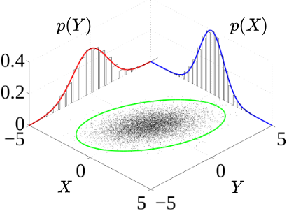

## Goals today

:::: {.columns}
::: {.column}
- **Part 1:** Joint distributions and dependence
    - Joint distributions
    - Independence
    - Conditional distribution
    - Covariance and correlation
    - Bivariate normal distribution
:::
:::{.column}
- **Part 2:** Statistical Inference
    - Frequentist inference
    - Bayesian inference

:::
::::


# Part 1: Joint distributions and dependence

## Why dependence matters in simulation

::: {.center .fragment style="margin-top: 50px; font-size: 2em; color: blue;"}
In real systems, random variables rarely act alone.
:::

::: {.fragment .center}
**Examples:**

- High arrival rate  → longer waiting times  
- High demand        → longer service times (fatigue, overload)  
- High rainfall      → high river levels  
- High market return → high portfolio return 
  
:::

::: {.fragment .center}

Incorrectly assuming independence can lead to:

- Underestimated variance
- Biased risk estimates
- Unrealistic system behaviour

:::

::: {.center .fragment style="margin-top: 20px; font-size: 1.5em; color: blue;"}
Simulation provides *flexibility* to incorporate complex dependence structures — but only if we understand the **joint distribution**.
:::

## Joint distributions

::: {#fig-joint .center}


[Joint probability distribution samples (black) and marginal densities (blue and red)](https://en.wikipedia.org/wiki/File:Multivariate_normal_sample.svg)
:::

- The surface is the joint density $f_{X,Y}(x,y)$.
- The curves along the axes are the **marginals** $f_X(x)$ and $f_Y(y)$. 
- The scatter cloud (in green circle) shows sample points from the joint distribution.

::: {.fragment}
A joint distribution is a **multivariate distribution**. It is the probability structure that describes how several random variables behave together. 

- For two variables $X$ and $Y$, the joint distribution $f_{X,Y}(x,y)$ is a **bivariate distribution**. 

- For $k$ variables, $X_1, \dots, X_k$, the joint distribution $f_{X_1,\dots ,X_k}(x_1,\dots ,x_k)$ is a multivariate distribution.
:::

::: notes
A **marginal distribution** tells you how one variable behaves on its own, regardless of the other.
:::

---

#### Discrete case

::: {.note .center .fragment .no-borders}
|||
|-----|--------------|-----|--------------|
| **Joint PMF** | $p(x,y) = P(X=x, Y=y), \qquad p(x,y) \ge 0, \qquad \sum_x \sum_y p(x,y) = 1.$ |
| **Joint CDF** | $F_{XY}(x,y) = P(X\leq x, Y\leq y) = \sum_{x_i \leq x}\sum_{y_j \leq y} p(x_i, y_j).$ |
| **Marginals** | $p_X(x) = \sum_y p(x,y), \qquad p_Y(y) = \sum_x p(x,y).$ |
:::

<span style="display: block; margin: 24px 0;"></span>

#### Continuous case

::: {.note .center .fragment .no-borders}
|||
|-----|--------------|-----|--------------|
| **Joint PDF** | $f(x,y), \qquad f(x,y) \ge 0, \qquad \int_{-\infty}^{\infty} \int_{-\infty}^{\infty} f(x,y)\,dx\,dy = 1.$ |
| **Joint CDF** | $F(x,y) = P(X \le x, Y \le y) = \int_{-\infty}^{x} \int_{-\infty}^{y} f_{X,Y}(u,v)\, dv\, du.$ |
| **Marginals** | $f_X(x) = \int f(x,y)\,dy, \qquad f_Y(y) = \int f(x,y)\,dx.$ |
:::

<span style="display: block; margin: 24px 0;"></span>

#### Mixed case: $X \in \{1,2,\dots,k\}, \quad Y \text{ continuous}$

::: {.note .center .fragment .no-borders}
|||
|-----|--------------|-----|--------------|
| **Joint distribution** | $f_{X,Y}(x,y) = P(X=x)\, f_{Y\mid X}(y \mid x), \qquad x=1,\dots,k.$ |
| **Joint CDF** | $F_{X,Y}(x,y) = P(X \le x,\, Y \le y) = \sum_{x_i \le x} P(X=x_i)\, F_{Y\mid X}(y \mid x_i).$ |
| **Marginals** | $P(X=x) = \int_{-\infty}^{\infty} f_{X,Y}(x,y)\,dy \qquad f_Y(y) = \sum_{x=1}^k f_{X,Y}(x,y).$ |
:::


## Independence

The case in which the variables do not influence each other at all. 

::: {.note}

$X$ and $Y$ are independent $\forall x,y$ if

$$
\begin{aligned}
p(x,y) &= p_X(x) \, p_Y(y) \qquad \text{(discrete)}\\
f(x,y) &= f_X(x) \, f_Y(y) \qquad \text{(continuous)}
\end{aligned}
$$

:::

::: {.fragment}
**Discrete Case Example** 

Let $X$ and $Y$ be two discrete independent random variables 

- $X\sim \mathrm{Bernoulli}(0.5)$ and 
- $Y\sim \mathrm{Bernoulli}(0.3).$

:::

::: {.fragment}

Because $X$ and $Y$ are independent, we simulate them separately.

```{r}
set.seed(123)
n <- 5000
X <- rbinom(n, 1, 0.5)
Y <- rbinom(n, 1, 0.3)
cor(X, Y)
```

The correlation is close to 0.

::: 

---


**Continuous Case Example** 

::: {.fragment}
Let X and Y be continuous independent random variables $X\sim \mathcal{N}(0,1)$ and $Y\sim \mathcal{N}(5,4)$

Because of independence:

$$f_{X,Y}(x,y)=f_X(x)\, f_Y(y)=\frac{1}{\sqrt{2\pi }}e^{-x^2/2}\times \frac{1}{\sqrt{8\pi }}e^{-(y-5)^2/8}$$
:::

::: {.fragment}

```{r}
#| fig-height: 3
set.seed(123); X <- rnorm(5000, 0, 1); Y <- rnorm(5000, 5, 2)
cor(X, Y)   # close to 0
par(mar = c(4,4,0,1)); plot(X, Y, pch=16, cex=0.4)
```

The scatterplot looks like a round cloud, with no directional trend.
:::

---

## Conditional distributions

But most real systems are not independent. In practice, we often observe one variable first and then ask:

> How does this information affect the behaviour of the other variable?

Dependence is formalised through conditional distributions.

::: {.note}

$$
\begin{aligned}
P(X=x \mid Y=y) &= \frac{p(x,y)}{p_Y(y)}, \quad p_Y(y)>0 \qquad \text{(discrete)} \\
f_{X|Y}(x \mid y) &= \frac{f(x,y)}{f_Y(y)}, \quad f_Y(y)>0\qquad \text{(continuous)}
\end{aligned}
$$

:::

Recall that independence was defined by

$$
f(x,y) = f_X(x) f_Y(y).
$$

Rewriting this gives

$$
f_{Y|X}(y \mid x)
=
\frac{f(x,y)}{f_X(x)}.
$$

If independence holds, then

$$
f_{Y|X}(y \mid x)=f_Y(y).
$$

::: {.fragment}
>Independence is exactly the situation in which conditioning has no effect. Conditional probability becomes marginal.
:::

---

**Discrete Case Example**

<br>

Suppose a small coffee shop with two types of customers:

::: {.nonincremental}
- **Type A** customers are quick to serve 60% of a time.
- **Type B** customers take longer to order 40% of a time.
:::

Let $X$ be customer type, where $X=0$ and $X=1$ denote customer Type A and Type B, respectively.

Let $Y$ be number of ordered completed in the next hour.

- If the customer is Type A, baristas complete more orders (higher success probability; 70%).
- If the customer is Type B, baristas complete fewer orders (lower success probability; 40%).

::: {.fragment}
We model:

$$
\begin{aligned}
Y\mid X=0\sim \mathrm{Binomial}(n=10,p=0.7), \\
Y\mid X=1\sim \mathrm{Binomial}(n=10,p=0.4)
\end{aligned}
$$
:::

<br>

::: {.fragment}
This creates dependence between $X$ and $Y$. 

<br>

Even if we know the marginal distribution of $X$ and the marginal distribution of $Y$, we cannot simulate the system correctly without the conditional structure.
:::

---

```{r}
set.seed(123)
X <- rbinom(5000, size = 1, prob = 0.4)   # 40% Type B customers
Y <- ifelse(
  X == 0,
  rbinom(n, size = 10, prob = 0.7),    # Type A
  rbinom(n, size = 10, prob = 0.4)     # Type B
)
cor(X, Y)
```

```{r}
#| code-fold: true
#| fig-height: 3.3
#| fig-align: center
y <- 0:10
pmf_A <- dbinom(y, size = 10, prob = 0.7)   # X = 0 (Type A)
pmf_B <- dbinom(y, size = 10, prob = 0.4)   # X = 1 (Type B)

# Set up side-by-side plotting area
par(mfrow = c(2, 1), mar = c(4, 4, 0, 1))

# PMF for X = 0
barplot(
  pmf_A,
  names.arg = y,
  col = "steelblue",
  main = "",
  xlab = "Y",
  ylab = "P(Y | X = 0)",
  ylim = c(0, max(pmf_A, pmf_B))
)

# PMF for X = 1
barplot(
  pmf_B,
  names.arg = y,
  col = "firebrick",
  main = "",
  xlab = "Y",
  ylab = "P(Y | X = 1)",
  ylim = c(0, max(pmf_A, pmf_B))
)
```

- $P(Y \mid X=0)$ (Type A) are concentrated at higher values of $Y \rightarrow$ baristas complete more order on average. 
- $P(Y \mid X=1)$ (Type B) shifts downward, with higher probability on smaller values of $Y$. 
- **Note:** the value of $X$ changes the entire shape of the distribution of $Y$, not just its mean (dependency).

---

**Continuous Case Example** 

Suppose interarrival time $X$ of a coffee shop influences service time $Y$, such that

$$
Y = 2 + 0.5X + \varepsilon,
$$

$$
X \sim \text{Exp}(1),
\quad
\varepsilon \sim N(0, 0.2^2),
$$

and $X$ and $\varepsilon$ are independent.

- When customers arrive slowly (large $X$), baristas work more carefully.
- When arrivals are rapid (small $X$), service is faster.

::: {.fragment}

```{r}
set.seed(123)
x <- rexp(5000, rate = 1); eps <- rnorm(n, mean = 0, sd = 0.2)
y <- 2 + 0.5*x + eps; cor(x, y)
```
:::

::: {.fragment}
```{r}
#| fig-height: 2
par(mar=c(2,4,0,0), mgp = c(2, 0.7, 0)); plot(x, y, pch=16, cex=0.4)
```

:::

- Very high correlation. The scatterplot reveals a clear linear trend, and the correlation is positive.

---

## Covariance and correlation

::: {.note}

To quantify **linear dependence**, we define the covariance:

<span style="display: block; margin: 24px 0;"></span>

$$
\mathrm{Cov}(X,Y)
=
\mathbb{E}\left[(X-\mathbb{E}[X])(Y-\mathbb{E}[Y])\right].
$$

An equivalent expression is

<span style="display: block; margin: 24px 0;"></span>

$$
\mathrm{Cov}(X,Y)
=
\mathbb{E}[XY] - \mathbb{E}[X]\mathbb{E}[Y].
$$

::: {.fragment}

If $X$ and $Y$ are independent, then


$$\mathrm{Cov}(X,Y) = 0.$$

:::

::: {.fragment}

The **correlation coefficient** is


$$\rho = \frac{\mathrm{Cov}(X,Y)}{\sigma_X \sigma_Y},$$

which lies in $[-1,1]$.

:::

- Correlation measures **linear association** but does not fully describe dependence. 

- Two variables may be uncorrelated yet dependent.

:::

::: {.fragment}

**Example:** Let $X \sim \text{Uniform}(-1,1)$ and $Y = X^2$.

Here, $Y$ is completely determined by $X$. So, knowing $X$ tells you exatly what $Y$ is (strong dependency).

$$
\text{Cov}(X,X^2)=E[X^3]−E[X]E[X^2]=0
$$

:::: {.columns}
::: {.column .center}
✅ Dependent
:::
::: {.column .center}
✅ Uncorrelated
:::
::::

:::

---

#### When to use covariance

<br>

Covariance is useful when you care about the **direction of the relationship**.

Covariance answers:

> “Do X and Y increase together or move in opposite directions?”

But the magnitude is **not interpretable**, because it depends on the units of X and Y.

<br>
<br>

#### When to use correlation

<br>

Correlation is the **standardised version of covariance**. It removes units and rescales the relationship to the familiar range [-1,1].

Correlation answers:

> “How strong is the linear relationship between X and Y, on a universal scale?”

Because it’s standardised, you can compare height vs weight, income vs education, temperature vs electricity use, etc,
even though all are in different units.

---

#### The sign of the covariance of two random variables $X$ and $Y$

```{r}
#| code-fold: true
#| fig-height: 3.5
set.seed(123)

par(mfrow = c(1, 3), mar = c(4, 4, 3, 1))

### 1. Negative covariance
x1 <- rnorm(500)
y1 <- -0.8 * x1 + rnorm(500, sd = 0.5)
plot(x1, y1,
     pch = 16, cex = 0.5, col = "steelblue",
     main = paste("Cov < 0\n", round(cov(x1, y1), 2)),
     xlab = "X", ylab = "Y")

### 2. Approximately zero covariance
x2 <- rnorm(500)
y2 <- rnorm(500)
plot(x2, y2,
     pch = 16, cex = 0.5, col = "darkgray",
     main = paste("Cov ≈ 0\n", round(cov(x2, y2), 2)),
     xlab = "X", ylab = "Y")

### 3. Positive covariance
x3 <- rnorm(500)
y3 <- 0.8 * x3 + rnorm(500, sd = 0.5)
plot(x3, y3,
     pch = 16, cex = 0.5, col = "firebrick",
     main = paste("Cov > 0\n", round(cov(x3, y3), 2)),
     xlab = "X", ylab = "Y")
```

- $\text{Cov}(X, Y) < 0$ shows a clear downward trend. As $X$ increases, $Y$ tends to decrease.
- $\text{Cov}(X, Y) ≈ 0$ shows a round, structureless cloud — classic independence‑looking scatter.
- $\text{Cov}(X, Y) > 0$ shows a clear upward trend. As $X$ increases, $Y$ tends to increase.

---

#### The sign of the correlation of two random variables $X$ and $Y$

```{r}
#| code-fold: true
#| fig-height: 3.5
set.seed(123)

par(mfrow = c(1, 3), mar = c(4, 4, 3, 1))

### 1. Negative correlation
x1 <- rnorm(500)
y1 <- -0.8 * x1 + rnorm(500, sd = 0.5)
plot(x1, y1,
     pch = 16, cex = 0.5, col = "steelblue",
     main = paste("Cor < 0\n", round(cor(x1, y1), 2)),
     xlab = "X", ylab = "Y")

### 2. Approximately zero correlation
x2 <- rnorm(500)
y2 <- rnorm(500)
plot(x2, y2,
     pch = 16, cex = 0.5, col = "darkgray",
     main = paste("Cor ≈ 0\n", round(cor(x2, y2), 2)),
     xlab = "X", ylab = "Y")

### 3. Positive correlation
x3 <- rnorm(500)
y3 <- 0.8 * x3 + rnorm(500, sd = 0.5)
plot(x3, y3,
     pch = 16, cex = 0.5, col = "firebrick",
     main = paste("Cor > 0\n", round(cor(x3, y3), 2)),
     xlab = "X", ylab = "Y")
```

- $\rho_{XY} < 0$ indicates a clear downward linear trend: as $X$ increases, $Y$ tends to decrease.

- $\rho_{XY} \approx 0$ produces a round, structureless cloud of points with no visible upward or downward tilt — the classic "no linear association" look.

- $\rho_{XY} > 0$ indicates a clear upward linear trend: as $X$ increases, $Y$ tends to increase.


## Special Case: Bivariate normal distribution

<br>

A bivariate normal distribution is a two‑dimensional version of the normal distribution. It describes the joint behaviour of two continuous random variables, usually written as:

<span style="display: block; margin: 24px 0;"></span>

$$(X,Y)\sim \mathrm{BVN}(\mu _X,\mu _Y,\sigma _X^2,\sigma _Y^2,\rho )$$

or 

<span style="display: block; margin: 24px 0;"></span>

$$
\begin{pmatrix}
X \\
Y
\end{pmatrix}
\sim
N
\left(
\begin{pmatrix}
\mu_X \\
\mu_Y
\end{pmatrix},
\begin{pmatrix}
\sigma_X^2 & \rho \sigma_X \sigma_Y \\
\rho \sigma_X \sigma_Y & \sigma_Y^2
\end{pmatrix}
\right)
$$

It is fully determined by five parameters:

::: {.nonincremental}
- mean of $X$: $\mu _X$
- mean of $Y$: $\mu _Y$
- variance of $X$: $\sigma _X^2$
- variance of $Y$: $\sigma _Y^2$
- correlation between $X$ and $Y$: $\rho$
:::

Here, the parameter $\rho$ controls linear dependence.

---

#### Key properties


1. Each marginal is normal $\quad X\sim N(\mu _X,\sigma _X^2),\qquad Y\sim N(\mu _Y,\sigma _Y^2)$

2. The joint density forms a 3D bell surface
The height of the surface at point $(x,y)$ is the joint density $f_{X,Y}(x,y).$
The shape of this surface depends heavily on the correlation $\rho.$

3. Contours are ellipses. If you slice the 3D surface horizontally, you get ellipses. The orientation of the ellipse tells you the sign of the correlation.

4. Independence happens only when $\rho =0$. This is *not* true for most distributions. It’s a unique property of the multivariate normal family.

::: {.fragment}
```{r}
#| code-fold: true
#| code-summary: 3D bivariate normal surfaces for different correlations
#| fig-height: 3.5
library(mvtnorm)

# Grid for evaluation
x <- seq(-3, 3, length = 50)
y <- seq(-3, 3, length = 50)
grid <- expand.grid(x = x, y = y)

# Function to compute BVN density matrix
bvn_matrix <- function(rho) {
  Sigma <- matrix(c(1, rho, rho, 1), 2, 2)
  z <- dmvnorm(grid, mean = c(0, 0), sigma = Sigma)
  matrix(z, nrow = length(x), ncol = length(y))
}

z_neg <- bvn_matrix(-0.8)
z_zero <- bvn_matrix(0)
z_pos <- bvn_matrix(0.8)

par(mfrow = c(1, 3), mar = c(2, 2, 3, 1))

# 1. Negative correlation
persp(x, y, z_neg,
      theta = 30, phi = 25,
      col = "lightblue",
      main = "ρ = -0.8 (tilts downward)",
      xlab = "X", ylab = "Y", zlab = "f(x,y)")

# 2. Zero correlation
persp(x, y, z_zero,
      theta = 30, phi = 25,
      col = "lightgray",
      main = "ρ = 0 (symmetric hill)",
      xlab = "X", ylab = "Y", zlab = "f(x,y)")

# 3. Positive correlation
persp(x, y, z_pos,
      theta = 30, phi = 25,
      col = "salmon",
      main = "ρ = 0.8 (tilts upward)",
      xlab = "X", ylab = "Y", zlab = "f(x,y)")
```

:::

---

We can simulate correlated normals using a **linear transformation**:

$$
X = Z_1, \qquad
Y = \rho Z_1 + \sqrt{1-\rho^2} Z_2
$$

```{r}
set.seed(123)
rho <- 0.8
z1 <- rnorm(5000); z2 <- rnorm(5000) # starting with independent standard nornals
x <- z1; y <- rho*z1 + sqrt(1 - rho^2)*z2 # linear transformation
cor(x, y)
```

```{r}
#| code-fold: true
#| fig-height: 4
# Define parameters
rho <- 0.7

# Create grid
x <- seq(-3, 3, length = 100)
y <- seq(-3, 3, length = 100)
grid <- expand.grid(x = x, y = y)

# Bivariate normal density (mean=0, var=1)
f <- function(x, y, rho) {
  1/(2*pi*sqrt(1 - rho^2)) *
    exp(-(x^2 - 2*rho*x*y + y^2) / (2*(1 - rho^2)))
}

# Compute density values
z <- matrix(f(grid$x, grid$y, rho), nrow = 100)

par(mar = c(0, 0, 0, 0))

# 3D perspective plot
persp(x, y, z,
      theta = 30, phi = 30,
      expand = 0.5,
      col = "lightblue",
      xlab = "X",
      ylab = "Y",
      zlab = "Density",
      ticktype = "detailed")
```


# Part 2: Statistical Inference

## Foundation

Up to this point, we have studied probability distributions and how to simulate random variables from them. We have generated data from known models and explored their behaviour through repeated sampling.

<br>

:::: {.columns}

::: {.column}
::: {.note .fragment}
**Probability** asks: If the model is known, what kind of data will we see?
:::
:::

::: {.column}
::: {.tip .fragment}
**Inference asks**: Given the data we observed, what can we say about the unknown model?
:::
:::

::::

<br>

::: {.fragment}
There are two major approaches to statistical inference:
:::

| <span style="color: blue;">**Frequentist Inference**</span> | <span style="color: blue;">**Bayesian Inference**</span>    |
|:-----------------------:|:-----------------------:|
| Treats probability as long-run frequency | Treats probability as a measure of uncertainty or belief |
| • Parameters are fixed but unknown.<br>• Data are random.<br>• Uncertainty is described using sampling distributions.<br>• Inference is based on long-run repeated sampling behaviour. | • Parameters are treated as random variables.<br>• Prior beliefs are updated using observed data.<br>• Uncertainty is described using the posterior distribution. |
| **Example:** <br>• Maximum Likelihood Estimation (MLE)<br>• Confidence Intervals<br>• Hypothesis testing | **Example:** <br> • Bayes’ theorem provides the updating mechanism: $\text{Posterior} \propto \text{Likelihood} \times \text{Prior}$<br>• Credible interval for interval estimation |

: {.striped .fragment}

---

## Frequentist Inference

::: {.note}
Drawing conclusions from data based on the idea that probability describes long-run frequency.
:::

- parameter we want to estimate is treated as fixed but unknown
- data are considered random

::: {.fragment}
<span style="color: blue; font-size: 1em;">**Terminology**</span>
:::

| Concept    | What it Refers To | Meaning | Example |
|---------|-------------------|---------------|---------------|
| **Parameter** | A true numerical characteristic of a **population** | Fixed but usually unknown value | Population mean $\mu$, population variance $\sigma^2$ |
| **Statistic** | A numerical summary calculated from a **sample** | Random variable as it depends on sampled data | Sample mean $\bar{x}$, sample variance $s^2$ |
| **Estimator** | A **rule, formula, or method** used to estimate a parameter | Function of sample data used to compute a statistic | $\hat{\mu} = \bar{X} = \frac{1}{n}\sum X_i$ |
| **Estimate** | The **numeric value** obtained from applying an estimator to a sample | Realised value of the estimator | If $\bar{x} = 5.2$, then 5.2 is the estimate of $\mu$ |
| **Bias of an Estimator** | Measures how far the expected value of the estimator is from the true parameter | $\text{Bias}(\hat{\theta}) = E[\hat{\theta}] - \theta$<br> Unbiased: $E[\hat{\theta}] = \theta$  | Sample mean $\bar{X}$ is unbiased for $\mu$ |
| **Variance of an Estimator** | Measures how much the estimator varies across different samples | $\text{Var}(\hat{\theta}) = E[(\hat{\theta} - E[\hat{\theta}])^2]$ | $\text{Var}(\bar{X}) = \sigma^2/n$ |

: {.striped .fragment}

---

### Likelihood

We now consider a systematic way to estimate unknown parameters using observed data. One of the most widely used approaches is maximum likelihood estimation. But first, we have to know the likelihood function.

::: {.note .fragment}

Suppose we observe data $x_1, x_2, \dots, x_n$ from a probability distribution that depends on an unknown parameter $\theta$.

The likelihood function describes how plausible different values of $\theta$ are, given the observed data.

For independent **continuous** observations with **probability density function**, the likelihood function is

$$
\begin{aligned}
L(x_1, x_2, \dots, x_n \mid \theta) &= \prod_{i=1}^{n} f(x_i \mid \theta) \\
&= f(x_1\mid\theta)\,f(x_2\mid\theta)\dots f(x_n\mid\theta).
\end{aligned}
$$

Likewise, for independent **discrete** observations with **probability mass function**, the likelihood function is

$$
\begin{aligned}
L(x_1, x_2, \dots, x_n \mid \theta) &= \prod_{i=1}^{n} P(x_i \mid \theta) \\
&= P(x_1\mid\theta)\,P(x_2\mid\theta)\dots P(x_n\mid\theta).
\end{aligned}
$$

:::

::: {.fragment}

The likelihood function **measures how well different parameter values explain the observed data**.

In other words, the likelihood answers the question:

> If the parameter were $\theta$, how likely is it that we would observe the data we actually obtained?

:::

---

### Maximum likelihood

As a method to estimate unknown parameters using observed data, maximum likelihood estimation is based on the idea of choosing parameter values that make the observed data most plausible under the assumed statistical model.

::: {.note}
The maximum likelihood estimator (MLE) is the value of $\theta$ that **maximises the likelihood function**. Formally,

$$
\hat{\theta} = \arg\max_{\theta} L(\theta).
$$

In practice, it is often easier to work with the log-likelihood function

$$
\ell(\theta) = \log L(\theta),
$$

because logarithms convert products into sums, which simplifies calculations. Maximising the likelihood or the log-likelihood produces the same estimator.
:::
<br>

::: {.fragment}
Maximum likelihood estimators have several useful properties.

Under suitable conditions, the MLE tends to:

::: {.nonincremental}
- be **consistent**, meaning it approaches the true parameter as the sample size increases;
- have **small variance** among reasonable estimators;
- be **approximately normally distributed** when the sample size is large.
:::

These properties make maximum likelihood estimation a standard method for parameter estimation in statistics.
:::

---

**Example:** Consider a Bernoulli experiment where $X_i \sim \text{Bernoulli}(p),$ and $p$ is the probability of success. Suppose we observe $x_1, x_2, \dots, x_n.$ The likelihood function is

::: {.fragment}
$$
L(p) = \prod_{i=1}^{n} p^{x_i} (1-p)^{1-x_i}.
$$

This can be written as
:::

::: {.fragment}
$$
L(p) = p^{\sum x_i} (1-p)^{n - \sum x_i}.
$$

The log-likelihood is
:::

::: {.fragment}
$$
\ell(p) = \sum x_i \log p + (n-\sum x_i) \log (1-p).
$$

Using the first derivative test:
:::

::: {.fragment}
$$
\frac{\partial \ell}{\partial p} = \frac{\sum x_i}{p} - \frac{n-\sum x_i}{1-p}=0
$$

Rearrange, and then the estimator is
:::

::: {.fragment}
$$
\hat{p} = \frac{1}{n}\sum_{i=1}^{n} x_i.
$$

You can also use the second derivative test to confirm that this is the maximum solution. 
:::

::: {.fragment}
Thus, the MLE for the Bernoulli parameter $p$ is simply the sample proportion.
:::

---

```{r}
set.seed(123)

# True parameter (only for simulation)
p_true <- 0.35
n <- 40 # try larger n, what do you see?

# Data: Xi ~ Bernoulli(p_true)
x <- rbinom(n, size = 1, prob = p_true)

# Sufficient statistic and MLE
s <- sum(x)
p_hat <- mean(x) # s / n

s
p_hat
```

**Interpretation:**

- Based on the observed data, the probability of success that best explains seeing 18 successes out of 40 trials is $\hat{p} = 0.45$. 
- Because the sample size is small, the MLE $\hat{p}$ has high variability and may differ noticeably from the true parameter $p$. 
- As the sample size increases, the Law of Large Numbers implies that the sample proportion converges to $p$, so $\hat{p}$​ becomes more stable and typically closer to the true value.

---

```{r}
#| code-fold: true
loglik <- function(p, s, n) {
  s * log(p) + (n - s) * log(1 - p)
}

# Grid of p values
p_grid <- seq(0.001, 0.999, length.out = 500)

# Compute log-likelihood
ll_values <- loglik(p_grid, s, n)

# Plot
plot(p_grid, ll_values,
     type = "l",
     xlab = "p",
     ylab = "Log-Likelihood",
     main = "Log-Likelihood for Bernoulli(p)")

# Add MLE
abline(v = p_hat, lty = 2, col="red")

# Add true parameter (optional)
abline(v = p_true, lty = 3, col="blue")

# Legend
legend("topright",
       legend = c("MLE (p_hat)", "True p"),
       col = c("red", "blue"),
       lty = c(2,3))
```

---

### Confidence Interval (CI)

So far, we have focused on a single numerical estimate of an unknown parameter. Because samples vary, estimates do too, so we often report an interval instead of a single value.

### CI for the Mean

::: {.note}
Suppose we observe independent observations $X_1, X_2, \dots, X_n$ from a population with mean $\mu$ and variance $\sigma^2$.When the sample size is sufficiently large, the **CLT** implies that:

$$
\bar{X} \approx N\left(\mu,\frac{\sigma^2}{n}\right).
$$

This result allows us to construct a 95% confidence interval for $\mu$:

$$\bar{X} \pm z_{0.975}\frac{\sigma}{\sqrt{n}},$$

where $z_{0.975}$ is the 97.5th percentile of the standard normal distribution.

In practice, the population variance $\sigma^2$ is usually unknown and is replaced by the sample standard deviation $s$, leading to the interval

$$\bar{X} \pm z_{0.975}\frac{s}{\sqrt{n}}.$$

**Interpretation:** If the interval procedure is correct, approximately 95% of the confidence intervals should contain the true parameter.

:::

---


### CI for the MLE

::: {.note}
Suppose $\hat{\theta}$ is the maximum likelihood estimator of a parameter $\theta$. Under fairly general conditions, when the sample size is large, the MLE is approximately normally distributed:

$$
\hat{\theta} \approx N\left(\theta, \; \text{Var}(\hat{\theta})\right).
$$

Then, a 95% confidence interval can be written as $\displaystyle\hat{\theta} \pm z_{0.975}\sqrt{\text{Var}(\hat{\theta})}.$

In practice, the variance of the estimator is usually unknown and must be estimated from the data.
:::

<br>

::: {.fragment}

**Example (cont.)** For a Bernoulli model $X_i \sim \text{Bernoulli}(p),$ the approximate variance of this estimator is

$$
\text{Var}(\hat{p}) = \frac{p(1-p)}{n}.
$$

:::

::: {.fragment}

Replacing $p$ with the estimate $\hat{p}$ gives the standard error:

$$
\text{SE}(\hat{p}) = \sqrt{\frac{\hat{p}(1-\hat{p})}{n}}.
$$

Thus, a 95% confidence interval for $p$ is

$$
\hat{p} \pm 1.96\sqrt{\frac{\hat{p}(1-\hat{p})}{n}}.
$$

:::

---

## Bayesian Inference

::: {.note}
Drawing conclusions from data by treating probability as a measure of uncertainty or belief.
:::


### Bayes' Theorem

::: {.note .fragment}
If $A$ and $B$ are events and $P(B) \neq 0,$ Bayes' theorem is stated as:

$$
P(A \mid B) = \frac{P(B \mid A)\,P(A)}{P(B)},
$$

- $P(A \mid B)$ is the **posterior** probability of $A$ given $B$,
- $P(B \mid A)$ is the **likelihood** of $A$ given a fixed $B$,
- $P(A)$ is the **prior** probability without any given conditions,
- $P(B)$ a normalising constant ensuring probabilities sum to one.

::: {.fragment}
If events $A_i$ are mutually exclusive and exhaustive, i.e., one of them is certain to occur but no two can occur together, then the **Law of Total Probability** states that
$$
P(B)=\sum_{i=1}^k P(B \mid A_i)\,P(A_i).
$$

Substituting this expression for $P(B)$ into the denominator of Bayes' theorem gives:

$$
P(A_i \mid B) = \frac{P(A_i)P(B \mid A_i)}{\sum_j P(A_i)P(B \mid A_i)}.
$$
:::

:::

---

**Example:** Suppose a mail server knows the following from past data:

  - 10% of all incoming emails are spam.
  - 40% of spam emails contain the word "WIN".
  - 5% of non‑spam emails also contain the word "WIN".

::: {.fragment}
```{mermaid}
%%| echo: false
flowchart LR
    A[Email] --> B{Spam?}
    B -->|Yes 10%| C[Spam]
    B -->|No 90%| D[Not Spam]

    C -->|WIN 40%| E[Spam + WIN]
    C -->|No WIN 60%| F[Spam + No WIN]

    D -->|WIN 5%| G[Not Spam + WIN]
    D -->|No WIN 95%| H[Not Spam + No WIN]

    linkStyle default stroke:#000,stroke-width:2px
```
:::

::: {.fragment}

Let $W$ be the event that the email contains the word "WIN" and $S$ be the event that the email is spam.

First, we identify the probabilities: $P(S) = 0.10, P(\neg S) = 0.90, P(W \mid S) = 0.40,  P(W \mid \neg S) = 0.05$.
  
:::

---

Suppose that you receive a new email and notice it contains "WIN". Bayes' rule lets you compute the probability that it is actually spam.

The probability that it is actually spam is

<span style="display: block; margin: 24px 0;"></span>

$$
P(S \mid W) 
= \frac{P(W \mid S) \, P(S)}
       {P(W \mid S)P(S) + P(W \mid \neg S)P(\neg S)}.
$$


::: {.fragment}
Compute the numerator:
<span style="display: block; margin: 24px 0;"></span>

$$
P(W \mid S)P(S) = 0.40 \times 0.10 = 0.04
$$

:::

::: {.fragment}
Compute the denominator:
<span style="display: block; margin: 24px 0;"></span>

$$
P(W \mid S)P(S) + P(W \mid \neg S)P(\neg S) = 0.40(0.10) + 0.05(0.90) = 0.085
$$

<span style="display: block; margin: 24px 0;"></span>

:::

::: {.fragment}
Compute the posterior probability:

<span style="display: block; margin: 24px 0;"></span>

$$
P(S \mid W) =
\frac{0.04}{0.085}
\approx 0.4706
$$

<span style="display: block; margin: 24px 0;"></span>
:::

::: {.fragment}
Therefore, if an email contains the word **"WIN"**, the probability that it is spam is about **47.1%**.
:::

<span style="display: block; margin: 24px 0;"></span>

::: {.example .fragment}
**Exercise:** Calculate $P(\neg S | W)$
:::

--- 

### Bayesian Updating

::: {.note}

From Bayes' Rule:

$$
P(A \mid B) = \frac{P(B \mid A)\,P(A)}{P(B)}.
$$

In Bayesian inference, $P(B)$ is fixed and Bayes' theorem shows that the posterior probabilities are proportional to the numerator, thus

$$
P(A \mid B) \propto P(B \mid A) \cdot P(A).
$$

In words,

$$
\text{Posterior} \propto \text{Likelihood} \times \text{Prior}.
$$

<span style="display: block; margin: 24px 0;"></span>

The posterior distribution represents our updated knowledge about the parameter

:::

::: {.fragment}

**Coffee shop example from lecture 2:** Suppose that during the morning rush, a barista records 20 customers. Among these, 9 customers chose oat milk and the rest chose dairy. 


Let $X$ be the number of oat-milk orders out of 20 and $p$ be the true (but unknown) probability a customer chooses oat milk. This can be modelled as:

$$
p \sim \text{Beta}(\alpha=3, \beta=7) \qquad \text{(Prior belief)}
$$


$$
X \,|\, p \sim \text{Binomial}(n=20, p) \qquad \text{(Likelihood)}
$$

:::


::: {.fragment}

<span style="display: block; margin: 24px 0;"></span>

$$
\text{Posterior} \propto p^{X+\alpha-1}(1-p)^{(20-X)+\beta-1}
$$

:::

::: {.fragment}
This expression is exactly the *kernel* of a Beta distribution, and we observe $x=9$. Then, 
the posterior must be

$$
p \,|\, X \sim \text{Beta}(\alpha+X, \beta+(20-X))
\qquad \rightarrow \qquad
p \,|\, X \sim \text{Beta}(12, 18).
$$

:::


---


```{r}
#| fig-height: 4
set.seed(123); 

a <- rbeta(2000, shape1 = 3, shape2 = 7) # prior
b <- rbeta(2000, shape1 = 12, shape2 = 18) # posterior
mean(a)
mean(b)
par(mar=c(4,4,0,1), mfrow=c(2,1))
hist(a, breaks = 30, main = "", xlab = "p"); abline(v=mean(a), col="blue", lwd=4)
hist(b, breaks = 30, main = "", xlab = "p"); abline(v=mean(b), col="red", lwd=4)
```

The posterior mean is 0.4, so our belief shifts from 30% to 40%.

---

### Conjugate Priors

Some combinations of prior distributions and likelihood functions lead to particularly *convenient* forms for the posterior distribution. These are called **conjugate priors**.

The example from the previous slide is one of the example of conjugate prior, **Beta-Binomial**.

In more complicated models, conjugacy may not hold, and simulation-based methods such as Markov Chain Monte Carlo (MCMC) are required to approximate the posterior distribution.

The followings are common conjugate prior pairs:

| **Likelihood **                       | **Conjugate Prior** | **Posterior** |
| --------------- | --------------- | --------------- |
| Binomial                              | Beta            | Beta      |
| Poisson                               | Gamma           | Gamma     |
| Exponential                           | Gamma           | Gamma     |
| Normal | Normal          | Normal    |

: {.striped }

<br>


### Posterior Mean vs MLE {.fragment}

- The **MLE** depends only on the observed data.
- The **posterior mean** incorporates both prior information and the data.
- When the **sample size is large**, the influence of the prior becomes small and the posterior mean becomes close to the MLE. 
- When the **sample size is small**, the prior can have a stronger influence on the estimate.

---

**Example:** Calculate Beta–Binomial Posterior Mean

Recall the model:

$$
X \mid p \sim \text{Binomial}(n=20, p), \qquad p \sim \text{Beta}(\alpha=3,\beta=7),
$$

and we observed $x=9$ oat-milk orders out of $n=20$.


By Beta–Binomial conjugacy, and substituting $\alpha=3, \beta=7, n=20, x=9$ gives

$$
p \mid X=9 \sim \text{Beta}(12,18).
$$


If $p \sim \text{Beta}(a,b)$, then

$$
\mathbb{E}[p] = \frac{a}{a+b}.
$$

Therefore, for the posterior $\text{Beta}(12,18)$,

$$
\mathbb{E}[p \mid X=9] = \frac{12}{12+18} = \frac{12}{30} = 0.4.
$$

```{r}
# Posterior parameters
a <- 12
b <- 18

# Posterior mean (exact)
post_mean <- a / (a + b)
post_mean
```

---

### Credible Intervals

In Bayesian inference, uncertainty about a parameter is summarised using the posterior distribution. From this distribution, we can construct **credible intervals**.

::: {.note .fragment}
A credible interval is an interval that contains a specified proportion of the posterior probability.

For example, a 95% credible interval for parameter $\theta$ satisfies

$$
P(a \leq \theta \leq b \mid y) = 0.95
$$

:::

::: {.fragment}
Unlike frequentist confidence intervals, credible intervals have a direct probabilistic interpretation: 

> Given the observed data and the prior distribution, **there is a 95% probability that the parameter lies within the interval.**
:::

::: {.fragment}

**Example:** Beta–Binomial Credible Interval

A central 95% Bayesian credible interval is typically defined using posterior quantiles:

$$
\left[q_{0.025},\; q_{0.975}\right],
$$

where $q_\gamma$ is the $\gamma$-quantile of the posterior distribution. That is,

$$
P(p \le q_\gamma \mid X=9) = \gamma.
$$

So the 95% credible interval is

$$
\left[
F^{-1}(0.025;\, a=12,b=18),\;
F^{-1}(0.975;\, a=12,b=18)
\right],
$$

where $F^{-1}(\cdot; a,b)$ is the inverse CDF (quantile function) of a Beta(a,b) distribution.
:::


---

```{r}
# 95% central credible interval (exact, via Beta quantiles)
ci <- qbeta(c(0.025, 0.975), shape1 = a, shape2 = b)
ci

# Monte Carlo check (simulation)
set.seed(13)
B <- 20000; p_draw <- rbeta(B, shape1 = a, shape2 = b)

mean(p_draw) # should be close to post_mean
quantile(p_draw, c(0.025, 0.975)) # should be close to ci
```

The posterior mean 0.4 is our updated estimate of the oat-milk probability after observing 9 out of 20 orders. The 95% credible interval gives a range $[L,U]$ such that

$$
P(L \leq p \leq U \mid X= 9) = 0.95
$$

Unlike a confidence interval, this statement is a direct probability statement about the parameter 
$p$ (given the prior and the observed data).

---

```{r}
# Plot posterior with credible interval markers
par(mar=c(4,4,0,1))
hist(p_draw, breaks = 40, main = "", xlab = "p", freq = FALSE)
abline(v = ci, lwd = 2)
abline(v = post_mean, lwd = 2, lty = 2)
```